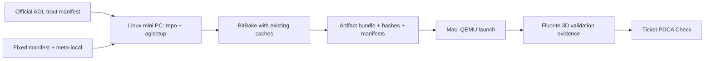

# Official AGL workflow and project host split

## Outcome

Automotive Grade Linuxの公式`trout`手順をupstream contractとし、このprojectではbuildと実行検証を次のhost roleへ分離する。

- `$BUILD_HOST`: Linux mini PC。AGL/Yocto source、`aglsetup.sh`、downloads、sstate、`tmp`、BitBake、image artifactを所有する。
- `$MAC_VALIDATION_HOST`: macOS。canonical repository、Codex/agent/MCP、artifact inventory、QEMU起動、Fluorite 3Dのscreen/log/input判定を所有する。

MacでBitBakeを実行すること、mini PCのGUIをMac QEMU検証とみなすことはしない。



## Official facts

The official `trout` documentation defines this build process:

1. prepare a supported native Linux build host;
2. download AGL with the `repo` tool and the AGL manifest repository;
3. source `meta-agl/scripts/aglsetup.sh` with machine, build directory, and AGL features;
4. inspect generated `local.conf` and `bblayers.conf`;
5. run BitBake for the selected image.

Sources:

- [Build process overview](https://docs.automotivelinux.org/en/trout/01_Getting_Started/02_Building_AGL_Image/01_Build_Process_Overview/)
- [Preparing the build host](https://docs.automotivelinux.org/en/trout/01_Getting_Started/02_Building_AGL_Image/02_Preparing_Your_Build_Host/)
- [Initializing the build environment](https://docs.automotivelinux.org/en/trout/01_Getting_Started/02_Building_AGL_Image/04_Initializing_Your_Build_Environment/)
- [IVI Flutter apps](https://docs.automotivelinux.org/en/trout/01_Getting_Started/03_Build_and_Boot_guide_Profile/04_IVI_Flutter_apps/)
- [Building for x86 emulation](https://docs.automotivelinux.org/en/trout/01_Getting_Started/02_Building_AGL_Image/06_Building_the_AGL_Image/02_Building_for_x86_%28Emulation_and_Hardware%29/)
- [Building for Raspberry Pi 4](https://docs.automotivelinux.org/en/trout/01_Getting_Started/02_Building_AGL_Image/06_Building_the_AGL_Image/03_Building_for_Raspberry_Pi_4/)
- [Yocto Project Scarthgap quick build and host requirements](https://docs.yoctoproject.org/scarthgap/singleindex.html)

The official AGL host page recommends a native Linux distribution supported by the corresponding Yocto release and at least 100 GB free disk space. The fixed manifest uses Yocto Scarthgap; its official quick-build guide includes Ubuntu 22.04, requires at least Python 3.8, Git version 1.8.3 patch level 1, tar 1.28, GCC 8, and GNU make 4, and recommends at least 90 GB disk and 8 GB RAM. The captured setup manifest identifies the build OS as Ubuntu 22.04.5. This supports the mini-PC build boundary; it does not support moving the Yocto build to macOS.

AGL's `trout` host page contains older generic Yocto version examples, so release-specific package/version decisions must be checked against the fixed Poky `scarthgap` revision and Scarthgap documentation, not copied from that generic paragraph alone.

## Current mini-PC host check

Read-only checks on 2026-07-19 found:

- Ubuntu 22.04.5 from the generated AGL setup manifest;
- 28,855 MiB RAM;
- 141 GiB free on the filesystem that owns the existing Yocto cache/tmp roles;
- 16 GiB free on the AGL source filesystem;
- required checked build commands and `en_US.UTF-8` locale available;
- system Python 3.10.12.

The host satisfies the measured Scarthgap minimums for RAM, supported distribution, and current cache filesystem free space. The 16 GiB source-filesystem margin is a separate risk, and every build plan must re-check all actual `DL_DIR`/`SSTATE_DIR`/`TMPDIR` filesystems before execution. Python 3.10 meets Yocto's requirement; Codex CLI is not required on the mini PC. Remote MCP compatibility is a separate runtime contract and must pass its own smoke test.

## Source acquisition contract

The official Flutter guide uses the AGL manifest repository and `trout` branch:

```sh
repo init -b trout -u https://gerrit.automotivelinux.org/gerrit/AGL/AGL-repo
repo sync
```

`repo sync` is state-changing and branch heads can move. Therefore:

- use the official command only when creating or intentionally refreshing a source checkout;
- do not run it against the existing baseline before a ticket records the current manifest and explicit approval;
- compare the result with `manifests/agl-trout-fixed.xml` before building;
- keep external `meta-vulkan` at `manifests/external-layers.lock`;
- keep project-owned changes in `layers/meta-local`, not as unexplained edits inside upstream layers.

The fixed XML in this repository is a captured input identity, not a replacement for understanding the official manifest flow. A future fresh-checkout runbook must prove how it consumes that XML without silently following newer branch heads.

## Build initialization contract

Official AGL configuration is generated by `aglsetup.sh`; it is not hand-authored from an empty directory. The expected order on `$BUILD_HOST` is:

1. inspect `source meta-agl/scripts/aglsetup.sh -h` at the fixed revision;
2. select machine, build directory, and AGL features;
3. let `aglsetup.sh` create the build directory and base conf;
4. add the project layer and smallest project-specific configuration;
5. inspect effective layer/recipe/override values before build.

The files under `conf/` are sanitized snapshots and evidence for comparison or recovery. `scripts/materialize-build-conf.sh` is not the preferred fresh initialization path; use it only when a ticket explicitly chooses exact snapshot restoration and explains why official generation is not being used.

## Observed deltas that must not be guessed away

| Topic | Official documentation | Captured project baseline | Required decision |
| --- | --- | --- | --- |
| Raspberry Pi machine | `raspberrypi4` is the `aglsetup.sh` machine argument | captured setup manifest records `raspberrypi4`; its fixed template sets `MACHINE = "raspberrypi4-64"` | preserve the alias-to-effective-machine translation and verify both identities |
| Flutter demo image | official guide uses `agl-ivi-demo-flutter` | project uses `agl-ivi-image-flutter` plus Toyota Connected packages | trace image recipe/packagegroup provenance before changing target |
| QEMU launch | official x86 flow assumes Linux `runqemu`, commonly KVM/VNC | validation host is Apple Silicon macOS | treat Mac QEMU command/device/acceleration as a separate Target Validation contract |
| Project graphics | official demo does not define this Fluorite/Filament customization | `meta-local` enables Flutter Vulkan/Filament and compositor patches | verify package, runtime device, surface, presentation, and scene separately |

These are facts about two different strata, not evidence that either side is wrong.

## Artifact handoff from mini PC to Mac

Every QEMU test input must be an indexed bundle produced on `$BUILD_HOST`:

- fixed AGL manifest hash and project Git revision;
- `MACHINE`, `DISTRO`, image target, active features, layer revisions;
- kernel and root filesystem/disk image roles;
- `qemuboot.conf` or equivalent boot parameters when available;
- image package manifest and testdata/SPDX identity when available;
- SHA-256 and byte size for every transferred artifact.

The bundle itself stays outside Git when large. Git stores only the redacted evidence index and hashes. The Mac validator must not select “the newest file” by timestamp alone.

## Mac validation contract

Official `runqemu` documentation is Linux-oriented. For macOS:

- build nothing locally;
- record QEMU version, host architecture, accelerator, machine, CPU, display, GPU, network, input, kernel arguments, and artifact hashes;
- distinguish qemux86-64 under TCG from qemuarm64 under HVF;
- distinguish boot success, compositor readiness, Vulkan device selection, Flutter readiness, Fluorite scene visibility, and interaction;
- return evidence to the owning AGL/Yocto/Flutter/Filament/Graphics contexts without inferring root cause in Target Validation.

## UNKNOWN

- The generated setup manifests confirm the machine and resolved feature set, but do not preserve the complete original shell command. The remaining command-line details are UNKNOWN.
- AGL's official `trout` documentation does not establish a supported macOS QEMU graphics path for this image; the Mac launch contract is project-owned.
- Whether qemux86-64 TCG or qemuarm64 HVF becomes the primary Mac feedback loop remains a measured decision under FLR-0002/FLR-0003.
