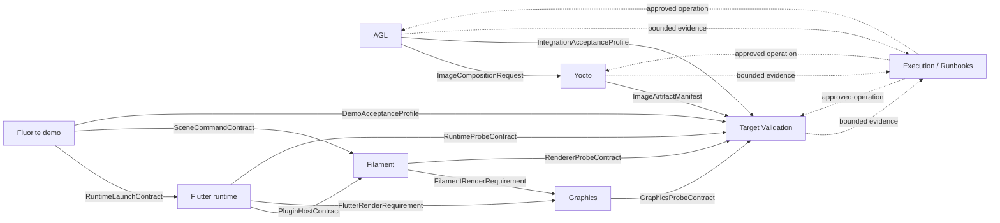

# Domain context map

## Map

実線はdomain contractの流れ、破線はExecutionまたはvalidationによるsupporting relationを示す。矢印は組織上の上下関係ではなく、明示されたcontractのproducerからconsumerへの向きである。

## Relationship contracts

| Producer | Published contract | Consumer | Translation rule |
| --- | --- | --- | --- |
| AGL | `ImageCompositionRequest` | Yocto | AGL feature/image intentをrecipe、variable、targetへ直接見立てず、Yocto adapterが解決可能なbuild requestへ変換する。 |
| Fluorite demo | `RuntimeLaunchContract` | Flutter runtime | app entrypoint、bundle、readiness requirementだけを渡し、Engine内部typeをdemo modelへ持ち込まない。 |
| Fluorite demo | `SceneCommandContract` | Filament | public Dart facadeだけをpublished languageとし、native pointerやengine objectをdemoが所有しない。 |
| Flutter runtime | `PluginHostContract` | Filament | registration、message、thread、surface handshakeを明示し、Filament entity semanticsと分離する。 |
| Flutter runtime | `FlutterRenderRequirement` | Graphics | renderer requirementをWayland/Vulkan primitiveへadapterで翻訳する。 |
| Filament | `FilamentRenderRequirement` | Graphics | engine backend requirementをdevice、queue、swapchain、present requirementへ翻訳する。 |
| Yocto | `ImageArtifactManifest` | Target Validation | artifact pathだけでなくimage ID、machine、distro、revision、package manifestを渡す。 |
| AGL | `IntegrationAcceptanceProfile` | Target Validation | service/app/compositor integrationの観測条件を渡し、target commandへ直接変換しない。 |
| Fluorite demo | `DemoAcceptanceProfile` | Target Validation | scene visibility、readiness、interactionを独立したvalidation caseとして渡す。 |
| Runtime contexts | probe contracts | Target Validation | probe名と期待signalだけを渡し、validatorは原因推論を返さない。 |

## Anti-corruption rules

- AGLとYoctoは別contextである。AGLの`feature`をBitBake variable名と同義にしない。
- Fluorite、Flutter、Filamentの`scene`、`frame`、`surface`、`view`を共有entityにしない。
- `package present`は`runtime capability available`の証明ではない。
- `Vulkan loader present`は`device selected`または`hardware acceleration active`の証明ではない。
- Target Validationのpass/failはobserved executionに対する判定であり、build/sourceの原因断定ではない。
- Executionのexit codeはdomain verdictではない。対応contextのagentがevidenceを解釈する。

## Integration style

各MCPはcontext固有のOpen Host Serviceとして小さなread/query surfaceを公開する。consumerはAnti-Corruption Layerで自contextの語へ翻訳する。全serverが同じdomain objectを共有するShared Kernelは採用しない。

共通の`EvidenceEnvelope`は運搬と追跡のためだけに使う。詳細は[Evidence and handoff contract](evidence-handoff-contract.md)を参照する。
