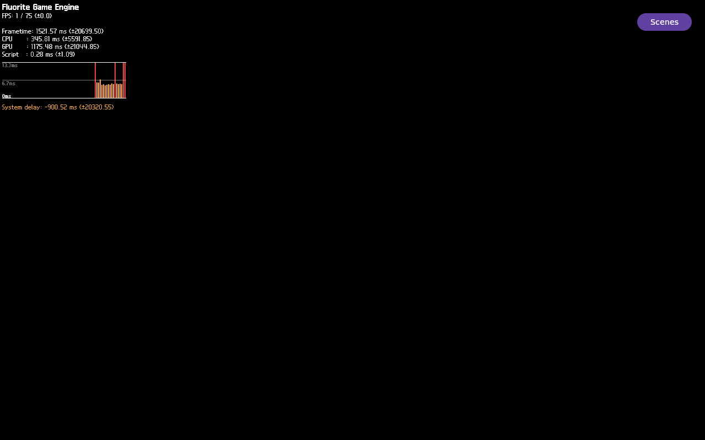

# FLR-0337 evidence — matched user page fault and FEngine Oops

## Outcome

The combined trace captured the recurring fault on the user exception path.
TID 703's `exceptions:page_fault_user` event matches the following kernel
Oops by TID, instruction pointer, and fault address. The run still shows only
the 2D HUD; the lower 3D region is uniformly black. No product change was
made. Root cause and relation to queue-present remain UNKNOWN.

## Runtime identity and controls

- Run: `flr0337-0001`; raw evidence remains on the Mini at
  `$EVIDENCE_ROOT/flr0337-0001/qemu`.
- Rootfs SHA-256:
  `5c8ca252181fac1a64669ae78de5b3fa590db1048f95f156db306df2f9d821ec`
- Qemuboot SHA-256:
  `ef5309f471e4bd159febbbc2c630368ec609d21900179b3694a6fb6c16f8c44a`
- Kernel SHA-256:
  `3df534706393cae86cc81340c3f8c77a0be732ab6be494bc5c845cf2fe07bc74`
- One QEMU at 6144 MiB; exact FLR-0335 rootfs/qemuboot/kernel and fixed
  build/TMPDIR reused. No build, patch, Devtool, or image change.
- Guest preflight passed before app launch: `perf` 6.6.111, both exception
  tracepoints available, `perf_event_paranoid=2`, and required perf/frame-
  pointer kernel configuration present.

## Fault-window facts

- App PID 655 launched at guest uptime `58.69`; perf PID 645 recorded both
  `exceptions:page_fault_kernel` and `exceptions:page_fault_user`.
- At monotonic `87.583394138`, `FEngine::loop` TID 703 emitted:

  ```text
  exceptions:page_fault_user address=0xd55d7750
  ip=0x7f0940fea541 error_code=0x0
  ```

- The kernel Oops followed at monotonic `87.583812` (418 microseconds later)
  for TID 703, with:

  ```text
  #PF: supervisor read access in user mode
  #PF: error_code(0x0000) - not-present page
  RIP: 0033:0x7f0940fea541
  RSP: 002b:00007f08d55d7750
  CR2: 00000000d55d7750
  ```

- The fault IP mapped to `/usr/lib/libLLVM.so.18.1`, file offset `0xb1d541`,
  `llvm::CmpInst::isOrdered+1`. Historical FLR-0335 GDB disassembly at the
  same exact image offset decoded the byte at `+1` as `iret`; this FLR-0337
  run did not single-step or disassemble the live instruction.
- The selected 40-ms `perf script` output contained six user-fault event
  blocks and no kernel-fault block. The selected output showed 39 lines; the
  full recording summarized 159,051 samples / 26.727 MB. Total perf
  lost-sample status is UNKNOWN because no complete loss accounting was
  retained.
- The parent app survived; recorded TID 703 was absent from its thread set.
  No matching `coredumpctl` entry was listed. Other FEngine and llvmpipe
  workers remained.

## Render and present boundary

Bounded app-log counts:

| Marker | Count |
| --- | ---: |
| `FLR0026_SCENE_STAGE_DRAW_END` | 19 |
| `FLUORITE_NATIVE_WAYLAND_COMMIT` | 19 |
| `FLR0026_VK_QUEUE_PRESENT_BEGIN` | 1 |
| `FLR0026_VK_QUEUE_PRESENT_RETURN` | 0 |
| `FLUORITE_VK_PRESENT_CALL_BEGIN` | 1 |
| `FLUORITE_VK_QUEUE_PRESENT_ENTER` | 1 |
| `FLUORITE_VK_QUEUE_PRESENT_RETURN` | 0 |
| `FLUORITE_VK_PRESENT_DONE` | 0 |

The Sequoia GLB asset reached `asset_present=true` with 12 renderable
entities and entered the Scene. Emissive texture index 6 changed from
`texture_ready=false` to `true`, then `GLTFIO_EMISSIVE_APPLY` reported
`add_dependency=false`. This proves the asset and binding path reached these
markers; it does not prove the shader sampled the texture or that the light
rendered. A missing texture path is therefore not the leading explanation
for this run, but texture sampling remains UNKNOWN.

## QMP visual evidence

- Resolution: 1280×800; QMP full-frame PPM SHA-256:
  `7be23df9c20799e5b8f0f26ed7393ccc5992f228496a94d70021c858cde71530`.
- The frame visibly shows the Fluorite HUD, FPS/frametime/CPU/GPU statistics,
  performance graph, and Scenes button. It shows no Sequoia/3D object.
- The fixed lower ROI `(0,200,1280,600)` contains 768,000 pixels; compared to
  the pre-fault frame, changed pixels = 0, chromatic pixels = 0, luma range
  = `[0,0]`.
- Eight post-fault QMP captures had one unique PPM hash. The MP4 below is an
  8-second replay of that QMP sequence, not a continuous host recording.
- The PNG and replay are committed here; no QEMU disk image was copied to Mac.



[Open the 8-second QMP frame-sequence replay](FLR-0337-qmp-postfault-sequence.mp4).

## Evidence hashes

| Artifact | SHA-256 |
| --- | --- |
| Mini `serial-0337-fault-window.output` | `39d538be88c5340e72e4eead6c22307d43b2af5854311cccb1ed13fc4e9d403f` |
| Mini `serial-0337-runtime-state.output` | `bf1b4fb7c1310ccdfa336eec3779ee205cfa02e547f380a2cdc0cd8f5b4a6159` |
| Mini `serial-0337-stop-trace.output` | `a69e2556b97f56a95c627da610503fabf7c7ab5472a81be03474b4586f0e79ce` |
| Mini `serial-0337-stop-app.output` | `29144fecfb361a5bdfcf215e8bfba9dc6aad8044686938e94d6658d2aea74709` |
| QMP post-fault PNG | `a0baee4047715b76f75d1a49dbbf4889952f24ecc934c2645fc790cef611f4ca` |
| 8-second MP4 replay | `5a42fc74cab18403d29864ad0391744b14333759e3415e580e2ea8235bddc9c0` |

## Hypotheses and limits

1. **User execution/control-flow state at `isOrdered+1`:** supported by the
   same-TID user exception event and recurring one-byte-offset RIP. A hardware
   execution breakpoint before that byte is the next discriminator.
2. **The Oops RIP is saved context, not the faulting instruction:** remains
   possible; the error code says supervisor read even though the tracepoint
   class is `page_fault_user`.
3. **Fault is independent of missing queue-present return:** remains UNKNOWN;
   the same profile reaches one present-begin with no return, but temporal and
   thread correlation alone do not prove causality.

No source/image fix is justified by this evidence.

## Cleanup and process corrections

- Stopped only recorded PID 655 after `comm=flutter-auto`; guest
  `flutter_processes=0`.
- QMP quit accepted; harness reported `residual_targets=0 residual_qmp=0`.
- The saved poll result contains `FLR0337_FAULT_FOUND` and serial `rc=0`, but
  the outer SSH call returned 1. A read-only check of the saved-result branch
  returned 0; original wrapper cause remains UNKNOWN.
- One first attempt at a QMP helper hash check failed locally on nested-shell
  `$1` expansion under `set -u`; it failed before capture and changed no
  evidence. Using `cut` fixed the check.
- State capture occurred at uptime `534.26`, long after the Oops at `87.58`;
  the surviving parent/VM was not stopped promptly. The next run must bound
  debugger wait and stop the exact app/QEMU automatically on hit or timeout.
- The kernel excerpt command captured only 28 lines after the Oops; the full
  kernel Call Trace was not retained. Whole-recording perf loss status is
  also UNKNOWN. FLR-0338 should capture the pre-instruction stack directly.
