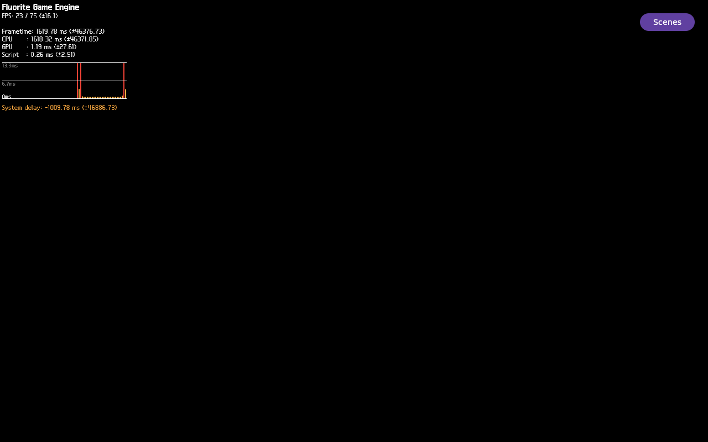

# FLR-0400-0001 — bounded live QMP observer result

- Ticket: [FLR-0400](../tickets/FLR-0400-bounded-live-observer-polling.md)
- Candidate: patch 0334; rootfs SHA-256
  `80935c3f9fa81da66f068821637f512749602c701baa37e91bf777b8cf15c44c`
- Runtime: one Mini QEMU, 6144 MiB, full QMP frame 1280×800; no build
- Raw PPMs/logs: `$BUILD_EVIDENCE/flr0400-0001/qemu/`
- Flutter identity at captured READY frame: PID 661, UID 1001, start token 2893;
  identity was live before and after capture
- Diagnostic profile: Sequoia selection, constant-LIT material override, and
  production-scene light setup were enabled; this is not original-material
  acceptance evidence

## Result

The bounded observer ended `PRESENT_DEADLINE_EXPIRED` after 120 seconds.
At the READY capture, the same identity reported `READY=1`,
`PRESENT_BEGIN=1`, `PRESENT_RETURN=0`, and `SUN=1`.

- Mini QMP READY PPM SHA-256:
  `fc0ad040ed3c76bdc4f4ebe39afade1de2b06524f7313c5e353b2a7cedab3511`
- Local review PNG SHA-256:
  `9186c48cf6b12d91ccb217e961d86602749b6db83a7c27c3a98e8ebe9ae720cf`
- Sequoia ROI `(440,220,400,360)`: 0 changed pixels, 0 edge pixels, and 0
  chromatic pixels; the region is uniformly black. The HUD and Scenes control
  are visible elsewhere in the same full frame.

The WAITING frame was uniformly black and identical to the pre-launch QMP
frame; it is not a Flutter rendering result.

- Mini QMP WAITING PPM SHA-256:
  `d4e96a65fd4f8e97bc1d762fc90cf2593bc2efb53a3125a72502fdae0f09395c`
- Local review PNG SHA-256:
  `3e25a09ca6defc8efa884ff9945f86dea746b99e7fd6c70fdfdfa8109877351a`
- Four-frame QMP review video (4 fps, 1 second):
  [waiting-qmp.mp4](FLR-0400-0001/waiting-qmp.mp4), SHA-256
  `a3dbeffc068bbc1071a4015e256e2d1ac999996ffed78bb1348c0c7254502bf1`.
  The four source QMP frames have the same pixels as the WAITING still.

## Runtime fault evidence and limits

- The bounded kernel journal records an `FEngine::loop` page-fault/Oops at
  `02:44:30 UTC`, CR2 `0x000000008d677750`, RIP `0x7fffefb4d541`, and RSP
  `0x00007fff8d677750`; the reported instruction bytes include `ff <cf>`.
- The focused Flutter coredump query returned `EMPTY`.
- No current-run GDB stack was emitted. GDB was launched as
  `/usr/bin/gdb --batch -ex run -ex 'thread apply all bt 8'`; `run` had not
  returned when the observer deadline triggered collection, so the later
  backtrace command did not execute. FLR-0401 owns that supervision correction.
- Similar signatures in FLR-0366/0391 do not prove the same faulting operation
  or establish LLVM, WSI, Present, material, texture, or composition as cause.
  The relationship between the Oops and unmatched Present remains UNKNOWN.

## Cleanup and artifact handling

- QMP quit and exact target cleanup passed. Postflight found zero target
  processes, no QMP socket, and ports 10930–10932 free.
- The raw Mini evidence remains under `$BUILD_EVIDENCE`; only QMP screenshots
  and the four-frame review video were copied to the Mac source workspace. No
  VM image, rootfs, kernel, cache, or build output was copied.
- The local PNG/MP4 review artifacts are intentionally small and committed
  alongside this evidence manifest; Mini raw logs remain the runtime source of
  truth.

## Conclusion

This run establishes that Flutter HUD pixels reached the full QMP frame while
the Sequoia ROI remained black in the pinned 0334 diagnostic profile. It is a
bounded observer/evidence success and a negative visual result for this run;
it does not identify the renderer fault's root cause or satisfy the product
goal. Original Sequoia materials/texture/lighting, HUD composition with visible
Sequoia, input/repaint stability, five minutes of progressing present, and two
independent boots remain unproven.
