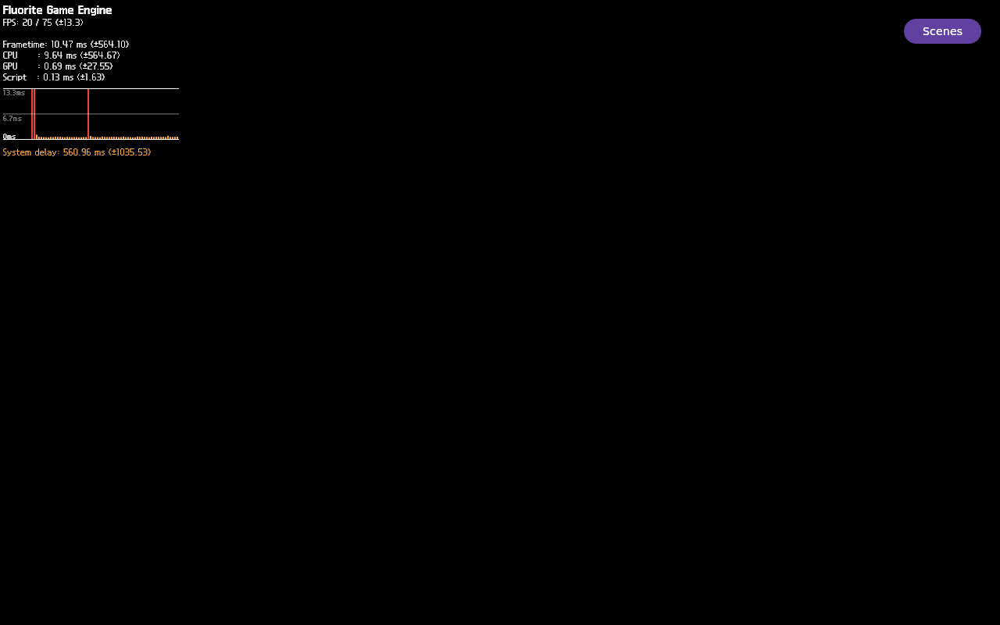

# FLR-0403 — QMP and FEngine Oops evidence (`flr0403-0001`)

## Verdict

Bounded, incomplete diagnostic. The QMP frame contains the Flutter HUD and
Scenes control, while the selected Sequoia ROI is black. The run used
diagnostic material and SUN overrides and the capture lacks an immediate app
identity bracket; it is not a product acceptance result. The kernel Oops was
not mapped to a GDB LWP or current ELF Build-ID. Root cause is UNKNOWN.

## Image and run identity

- Profile: existing Mini runqemu/QMP profile, 6144 MiB; exactly one QEMU.
- Mini receiver: clean detached role checkout at `54c02bdcd`.
- Rootfs SHA-256:
  `80935c3f9fa81da66f068821637f512749602c701baa37e91bf777b8cf15c44c`
- Kernel SHA-256:
  `3df534706393cae86cc81340c3f8c77a0be732ab6be494bc5c845cf2fe07bc74`
- Qemuboot SHA-256:
  `2363530e2f39d4e57465cb89e724327f699b8ab6247d9e1bb75fdc2a60780c10`
- Runqemu wrapper/child QEMU: PID 3071361 / PID 3071388. The wrapper is
  Python; the child was identified read-only by process ancestry.
- Guest app: Example Demo 3.32.5 `flutter-auto`, PID 646, UID 1001, start
  token 44270. Launch used Sequoia match/limit 2,
  `FLUORITE_SEQUOIA_LIT_MATERIAL_OVERRIDE=1`, and
  `FLR0305_PRODUCTION_SCENE_LIGHT=1`.
- Raw artifacts stay on Mini under `$BUILD_EVIDENCE/flr0403-0001/qemu/`.
  The bounded app-log export SHA-256 is
  `113a7d3e965f8ef48373488910c1014064f24eca05f0fb29018f2092dde10981`.

## Full-frame capture

QMP-only capture, 1280×800, about `2026-10-02T08:03:01Z`. The repository PNG
is the exact full screen; it is not cropped to the 3D ROI.

- PNG SHA-256:
  `7250445c0c30b5ee4596b42f511a56e343ee579b7507b251d8b9db0a42aad71a`
- Source PPM SHA-256:
  `816fe790c427110798dd4556e3ae56bf0126312ed8777f28670d76f63ce5415c`
- The four saved frame PPMs had the same hash as the still. No MP4 was
  produced; these identical samples are not evidence of motion/progress.
- HUD and Scenes are visible. Sequoia ROI `[440,220,400,360]`: 144,000/144,000
  black; changed pixels 0, edge pixels 0, chromatic pixels 0, luma range
  `[0,0]`.
- The last app identity snapshot before capture was about 39 seconds earlier;
  the next snapshot showed the app absent. The frame is QMP evidence, but
  same-instant live app identity is UNKNOWN.

## Runtime and fault evidence

- At `2026-10-02T08:02:22Z`: `READY=1`, `PRESENT_BEGIN=2`,
  `PRESENT_RETURN=1`, `SUN=1`.
- Kernel reported `FEngine::loop` page-fault Oops at guest uptime
  475.594763 s, TID 695, RIP `0x7fb61183e541`, CR2
  `0x00000000aaff9750`. Estimated host-aligned time:
  `2026-10-02T08:01:52.307952Z`. This preceded the READY snapshot by about
  16.25 seconds and the QMP image by about 69 seconds; timing is not causality.
- The bounded app timeout returned 124; `coredumpctl` found no core. The app
  was absent before GDB/maps/Build-ID collection. No `ptid`/LWP mapping or
  current ELF Build-ID was captured. Oops-to-present relation is UNKNOWN.
- First `dmesg --ctime` failed because BusyBox does not support that option;
  a bounded plain `dmesg` read succeeded. An initial process check looked for
  `qemu-system` in the Python `runqemu` wrapper and failed closed; ancestry
  inspection identified the actual QEMU child before any unsafe action.
- QMP quit passed. Postflight found no owned QEMU/runqemu/Flutter/QMP process,
  reserved listener, or image hash change.

## Evidence classification

- **Fact:** one HUD-visible QMP frame; black Sequoia ROI under the diagnostic
  profile; an FEngine kernel Oops record; no coredump; clean teardown.
- **Inference:** this profile's Sequoia output failed to appear in the sampled
  frame. The capture is not identity-bracketed.
- **Hypotheses:** the diagnostic override/profile may interact badly with the
  scene/present path; independently, the production Sequoia pipeline may be
  unhealthy. FLR-0404 tests the ordinary profile on the same image.
- **UNKNOWN:** original material/texture/light behavior, stable frame progress,
  Oops-to-LWP/ELF mapping, Oops causality, and same-frame production
  Sequoia+HUD behavior.
