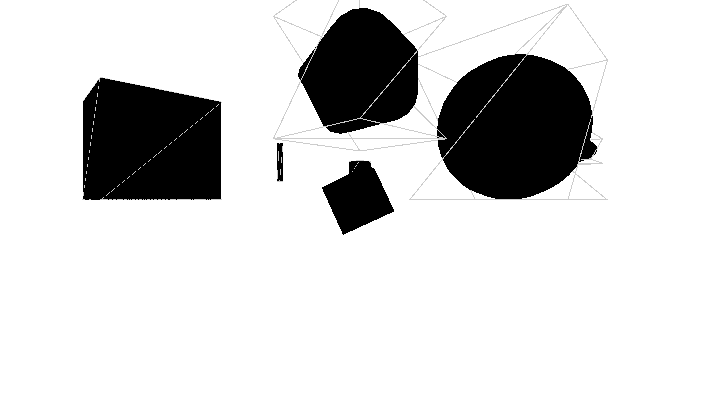
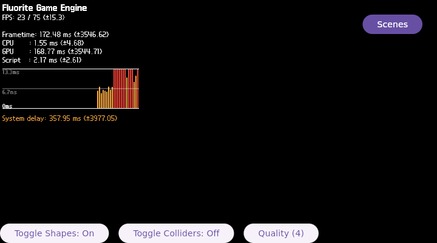

# FLR-0027 — shape-only/light-only rendering path separation

- Status: Done
- Priority: High
- Owner: Flutter runtime + Filament bridge + target-validation roles
- Depends on: FLR-0026
- Links: [FLR-0026](FLR-0026-fluorite-3d-display.md), `work/logs/2026-08-31-flr0026.md`
- Working log: `work/logs/2026-09-05-flr0027.md`
- Follow-up: [FLR-0028](FLR-0028-production-shape-light-coenabled.md)

## Problem

The self-made native cube produces real QMP pixels on the current Vulkan/Wayland/QEMU path, while the production scene stops after shape/light content is retained. The first failing production content boundary is still UNKNOWN.

## Purpose

Separate the production shape render path from the light setup path with runtime-only diagnostic conditions, so the first failing boundary can be identified before a production patch is selected.

## Success measure

Using the inherited fixed image/profile, run and compare shape-only and light-only conditions independently. Each condition must have a QMP-only screenshot, visible-region pixel count/bounding box/SHA-256, application/journal result, exact stimulus, and clean QMP teardown. The result must identify which condition is the first divergent boundary, or record UNKNOWN with the missing evidence.

## Stratification — 4W1H excluding Why

| Dimension | Observation | Evidence |
| --- | --- | --- |
| What | Production 3D content stops after scene content is retained | FLR-0026 runs 0197/0198/0199 |
| Where | QEMU graphical session; source change on Mac Devtool; build on Mini PC | inherited runbook and target logs |
| When | After native scene content setup; timing and first failing frame must be measured | new QMP/runtime runs |
| Who | runtime diagnosis, Devtool source edit, Mini PC build, target validation roles | role-based ownership |
| How | Hold camera/image/profile constant; vary only shape or light content | controlled A/B runs |

## Scope

### In scope

- Reuse the existing Devtool container, named volumes, source workspace, build directory, and caches.
- Diagnose shape-only first, then light-only, against the inherited known-good cube and production failure boundaries.
- Use QMP-only visual evidence and bounded system/GDB/syscall logs where available.

### Out of scope

- Production fix patch before the first failing content boundary is identified.
- Planetarium/scene navigation, compositor redesign, cache deletion, or a second container.

## Hypotheses

1. Production shape material/primitive/renderable command triggers the llvmpipe/LLVM failure.
2. Production light setup or shape-light interaction triggers the failure.
3. The first failure is elsewhere in the common production frame path. This remains a falsification case.

## PDCA

### Plan

- Confirm Docker and Devtool availability; if unavailable, leave this ticket `Waiting` without creating a workaround workspace.
- Run shape-only with fixed camera/material baseline, then light-only with the same fixed baseline.
- Capture early/late QMP-only images and runtime evidence for each condition.

### Do

- Source changes, if required, occur only in the existing Mac Devtool workspace.
- Generate any patch only through `devtool finish <recipe> <layer> --mode patch`; do not patch the layer by hand.

#### Progress — Devtool diagnostic preparation (2026-09-05)

- Fact: the persistent build volume contained a stale `/workspace/agl/meta-local` layer entry. It was removed from the active `bblayers.conf` only; downloads, sstate, and tmp were retained.
- Fact: after that correction, the standard `flutter-auto:do_patch` path passed with `PATCHTOOL="quilt"`.
- Fact: the component-scoped Devtool workspace for `fluorite-plugins` was reused. Source commit `23b0f2b` adds independent `FLR0027_NATIVE_SKIP_LIGHTS` and `FLR0027_NATIVE_SKIP_SHAPES` controls around production light and shape setup.
- Fact: `devtool finish --force --no-clean --mode patch` generated `0187-diag-separate-production-shape-and-light-setup-devtool.patch`; the registered layer copy is byte-identical (SHA-256 `d1018af64ac72b36a5dc1451928bc2008fc5e4ea35f4b2c59784612217de2b76`).
- Inference: the diagnostic patch is ready for the Mini PC authority build, but no runtime conclusion is valid until that build is booted and tested.

### Check

| Criterion | Expected | Actual | Evidence | Result |
| --- | --- | --- | --- | --- |
| Devtool diagnostic patch | component-scoped source commit and generated patch are byte-identical in the project layer | Source commit `23b0f2b`; generated/registered patch SHA-256 `d1018af64ac72b36a5dc1451928bc2008fc5e4ea35f4b2c59784612217de2b76` | `layers/meta-fluorite-trial/recipes-graphics/toyota/files/0187-diag-separate-production-shape-and-light-setup-devtool.patch` | PASS |
| Mini PC patch/build | bundle is received and authoritative BitBake accepts the patch | receiver `c1252c4`; `do_patch` 104/104; `do_compile` 2686/2686; full image 11748/11748 | fixed receiver/build log; rootfs/kernel/qemuboot hashes below | PASS |
| Shape-only | shape setup reaches visible 3D pixels with fixed model/environment skip | `FLR0027_NATIVE_SKIP_LIGHTS` enabled; 37 shapes reached `renderable=true`; QMP 720x400 region `[200,100,400,250]` changed `79338/100000`, bbox `[200,100,400,250]`; visual evidence shows black 3D faces and wireframe | `$QEMU_ARTIFACT_ROOT/flr0027/shape-only-manual3/shape-only-late.ppm`, SHA-256 `2439948803d165ae4339224099baf4428d2f972d63b8ceadf46ebb114856bb9b` | PASS |
| Light-only | light setup reaches frame/present without shape content | `FLR0027_NATIVE_SKIP_SHAPES` enabled; `shapes=37` skipped; QMP region changed `1208/100000`, bbox `[200,113,29,66]`; no geometry expected by this condition | `$QEMU_ARTIFACT_ROOT/flr0027/light-only-manual1/light-only-late.ppm`, SHA-256 `3b9a620a9007fd3aa93b0d99ee01766676b7dfb53b1a7849912b5f6f708e8081` | PASS |
| Present/commit | both diagnostic conditions reach the common output boundary | `VK_QUEUE_PRESENT result=0`, `PRESENT_BOUNDARY_DONE`, and `COMMIT_DONE` observed in both serial logs | `$QEMU_ARTIFACT_ROOT/flr0027/{shape-only-manual3,light-only-manual1}/serial-console.log` | PASS |
| Teardown | QMP quit and no associated process remains | both runs returned `reason=host-qmp-quit`; sockets and QEMU/Flutter/Weston processes absent afterward | each run's `qmp-quit.txt` | PASS |

### Act

- Close this ticket after the independent shape/light separation gate.
- Continue in [FLR-0028](FLR-0028-production-shape-light-coenabled.md) for the production shape+light co-enabled boundary. Do not add that new runtime loop to this ticket.

## Visual evidence

- Required: one QMP-only image per diagnostic condition, linked or attached from the evidence store.
- Required description: what is visible, what is not visible, and whether the image proves the requested behavior.
- Required identity: image/rootfs revision, run ID, timestamp, pixel summary, SHA-256/evidence ID.
- Raw QMP PPM files remain outside Git; these lightweight PNG photographs are committed so the ticket is self-contained.

### QMP-only photographs

The following images are captured from the QEMU monitor path only. They are not host-window screenshots.

| Condition | Photo | Visible result |
| --- | --- | --- |
| Shape-only |  | Black solid faces and wireframe geometry are visible in the native region; this is the 3D pixel PASS. |
| Light-only |  | The 2D HUD, FPS/CPU/GPU metrics, graph, Scenes button, and controls are visible; geometry is intentionally absent. |

Repository-copy image SHA-256: `shape-only-late.png` = `141ae3c5897c651b45a4a5d4dea4fe11d871a44b`; `light-only-late.png` = `3d22f729ab99419229dd163bf93d4853591243dbf41f3ba3d8dfc2b60dbd19f5`. The source QMP PPM hashes remain recorded in the acceptance table above.

## Runtime evidence identity

- Rootfs SHA-256: `9064e4e5bcebe7123512af9f1e5f32b4b8d239b8f770180b0e9056f6d2216664`
- Kernel SHA-256: `3df534706393cae86cc81340c3f8c77a0be732ab6be494bc5c845cf2fe07bc74`
- Qemuboot SHA-256: `47cbef3e17ace32cb9feaedeab36fc74b6c0d0cc932b9e43c3909214e5af3f0e`
- QEMU profile: qemux86-64, TCG multi-thread, 2048 MiB, 4 vCPU, virtio-vga 720x400, rootfs snapshot.
- QMP-only images are retained outside Git under `$QEMU_ARTIFACT_ROOT`; the ticket stores role paths and hashes only.

## Unknowns

- The production shape+light co-enabled path remains UNKNOWN; it is the scope of FLR-0028.
- Which production material/asset or shape-light interaction prevents the full scene from showing remains UNKNOWN.
