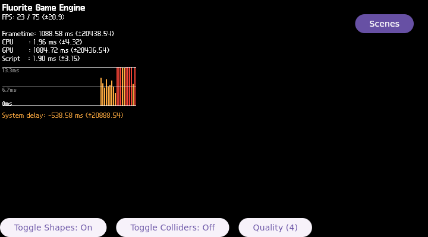

# FLR-0028 — production shape+light co-enabled rendering boundary

- Status: Done
- Priority: High
- Owner: Flutter runtime + Filament bridge + target-validation roles
- Depends on: FLR-0027
- Links: [FLR-0026](FLR-0026-fluorite-3d-display.md), [FLR-0027](FLR-0027-shape-light-rendering-separation.md)
- Working log: `work/logs/2026-09-06-flr0028.md`
- Follow-up: [FLR-0029](FLR-0029-present-boundary-page-fault.md)

## Problem

FLR-0027 proved that production shape setup can produce visible 3D pixels when lights are skipped, and that the light-only path reaches present/commit when shapes are skipped. The production shape+light co-enabled path is still not isolated against the same fixed model/environment baseline.

## Purpose

Run the smallest controlled production co-enabled condition and compare it with the two FLR-0027 controls. Determine whether the first new divergence occurs at light/shape interaction, a material/renderable command, or the common frame path before selecting another source change.

## Success measure

- Use the exact FLR-0027 rootfs/profile and one QEMU at a time.
- Run production with model and environment skipped, but both shapes and lights enabled.
- Capture QMP-only early/late images, visible-region pixel statistics, serial markers, and clean QMP teardown.
- Compare the result against FLR-0027 shape-only and light-only evidence.
- Record the first divergent boundary as Facts, Inferences, Hypotheses, and UNKNOWN.

## Stratification — 4W1H excluding Why

| Dimension | Observation | Evidence target |
| --- | --- | --- |
| What | production shapes and lights are both enabled | runtime flags and shape/light markers |
| Where | QEMU framebuffer and guest serial; source/build remain unchanged | QMP-only PPM and serial log |
| When | after app startup and during repeated frame/present | early/late captures and frame markers |
| Who | runtime diagnosis and target-validation roles | role-based working log |
| How | hold rootfs, camera, output region, and app bundle constant; vary only the co-enabled condition | A/B evidence |

## Scope

### In scope

- Reuse the existing fixed Mini PC artifact, QEMU evidence root, and one-container/one-receiver workflow.
- Use `FLR0026_NATIVE_SKIP_MODEL_LOAD=1` and `FLR0026_NATIVE_SKIP_ENVIRONMENT=1`; do not skip shapes or lights.
- Use QMP-only screenshots and serial runtime evidence.
- If the co-enabled condition is stable, exercise one bounded QMP scene/input transition in a follow-up ticket rather than expanding this ticket.

### Out of scope

- Editing or hand-authoring a new patch before the first co-enabled failure boundary is known.
- Planetarium navigation, compositor redesign, cache deletion, a second container, receiver, or TMPDIR.
- Calling background/2D pixel changes a 3D success without visual object evidence.

## Hypotheses

1. Shape-light interaction or lit material commands trigger the production divergence.
2. Production shapes are valid, but the enabled light/material path causes the renderer or llvmpipe to stop before stable present.
3. The co-enabled path remains stable and the remaining failure is later in production assets or scene composition.

## PDCA

### Plan

- Reuse FLR-0027 rootfs `9064e4e5...`, qemux86-64 profile, and fixed region `[200,100,400,250]`.
- Start one guest, explicitly launch the same Fluorite bundle as `agl-driver`, and keep QMP and serial evidence together.
- Stop at the first divergence; create a new Markdown ticket if a source fix or scene transition is the next unit.

### Do

- Runtime-only flags first; no source edit until evidence identifies the boundary.
- Keep QMP shutdown protocol as `qmp_capabilities` followed by `quit`.

### Check

| Criterion | Expected | Actual | Evidence | Result |
| --- | --- | --- | --- | --- |
| Co-enabled runtime | both shapes and lights are enabled under model/environment skip | `FLR0026_NATIVE_SKIP_MODEL_LOAD=1` and `FLR0026_NATIVE_SKIP_ENVIRONMENT=1`; 37 shapes reached `renderable=true`; lights were not skipped | `$QEMU_ARTIFACT_ROOT/flr0028/co-enabled1/serial-console.log` | PASS |
| QMP 3D evidence | object pixels and visible shape/light result identified | 720x400 QMP early/late are identical; native region changed `1268/100000`, bbox `[200,113,29,86]`; image is HUD-only and has no geometry | `$QEMU_ARTIFACT_ROOT/flr0028/co-enabled1/co-enabled-late.ppm`, SHA-256 `32caad392fafe6cc72198839fb177621f5667e94d3614c62d58499e9de8c676d` | FAIL — 3D not shown |
| First divergence | frame/present/scene boundary classified | queue submit, acquire, swapchain creation, and `VK_QUEUE_PRESENT_BEGIN` reached; immediately after, `FEngine::loop` page fault occurred | `$QEMU_ARTIFACT_ROOT/flr0028/co-enabled1/serial-console.log` | PASS — boundary isolated |
| Teardown | QMP quit and no associated process remains | QMP `quit` returned `reason=host-qmp-quit`; socket and QEMU/Flutter/Weston processes absent | `$QEMU_ARTIFACT_ROOT/flr0028/co-enabled1/qmp-quit.txt` | PASS |

### Act

- Close this ticket after the co-enabled acceptance gate.
- Close this ticket as the co-enabled boundary diagnosis, not as 3D success.
- Continue the page-fault ownership analysis in [FLR-0029](FLR-0029-present-boundary-page-fault.md). Do not add that analysis or a source patch to this ticket.

## Visual evidence

- Attach/embed at least one QMP-only early/late photograph before closing this ticket.
- Record the visible UI/3D state in the Check table, together with the QMP PPM hash, image revision, run ID, and serial-log path.
- Do not mark a black or HUD-only frame as 3D success; if a new source change is needed, close this ticket with the boundary and create a follow-up Markdown ticket.

### QMP-only photographs

| Condition | Photo | Visible result |
| --- | --- | --- |
| Co-enabled early |  | Partial 2D HUD appears; no native geometry is visible. |
| Co-enabled late |  | Full 2D HUD appears, but the native region remains black after the FEngine page fault. |

PNG SHA-256: `co-enabled-early.png` and `co-enabled-late.png` are both `2b296c4939a567475f09be59878b924e0f56ee275d5ddf7673ca605e7ea0f500`.

## Unknowns

- The co-enabled condition reproduces a runtime page fault after `FLR0026_VK_QUEUE_PRESENT_BEGIN`: PASS.
- The exact symbol/ownership of the page fault and whether it is a userspace library, guest kernel report, or QEMU-side artifact: UNKNOWN; FLR-0029 scope.
- Whether the selected fix will make the production object visible: UNKNOWN.
