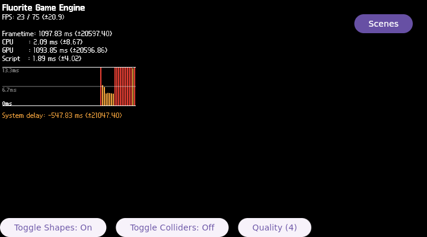

# FLR-0029 — present-boundary FEngine page-fault diagnosis

- Status: Done
- Priority: High
- Owner: runtime diagnosis + Filament bridge + target-validation roles
- Depends on: FLR-0028
- Links: [FLR-0028](FLR-0028-production-shape-light-coenabled.md), [FLR-0027](FLR-0027-shape-light-rendering-separation.md)
- Working log: `work/logs/2026-09-06-flr0029.md`
- Follow-up: [FLR-0030](FLR-0030-present-boundary-fault-capture.md)

## Problem

FLR-0028 reached shape creation, Vulkan acquire, queue submit, swapchain setup, and `FLR0026_VK_QUEUE_PRESENT_BEGIN` with production shapes and lights enabled. Immediately afterward the guest serial reported a page fault on `FEngine::loop`. The 3D region remained black.

## Purpose

Reproduce the first faulting boundary and verify that the image contains the tools needed for symbol/core capture before creating a source patch. Exact symbol ownership remains the follow-up unit.

## Success measure

- Reuse the exact FLR-0028 rootfs/profile, fixed QEMU evidence root, receiver, build, TMPDIR, and one-container workflow.
- Correlate the serial oops with process lifetime, core/backtrace availability, and the last native marker.
- Inspect the corresponding source/binary symbol path with static evidence; do not infer the cause from the address alone.
- Decide whether the next action is a Devtool diagnostic patch, a minimal behavior patch, or a runtime-only experiment.
- Attach/embed the QMP photograph and record all facts in this ticket before closing it; any selected fix becomes a new Markdown ticket.

## Stratification — 4W1H excluding Why

| Dimension | Observation | Evidence target |
| --- | --- | --- |
| What | page fault immediately after present begins | serial oops, last marker, exit status |
| Where | FEngine thread during co-enabled production path | process maps, symbols, backtrace |
| When | after first submit/acquire/present begin | ordered serial timestamps and QMP frame |
| Who | runtime diagnosis and target-validation roles | role-based working log |
| How | hold image and flags constant; add only fault-local evidence collection | A/B evidence |

## Scope

### In scope

- Read-only analysis of FLR-0028 serial, process state, crash/core evidence, and installed debug tools.
- One normal and one GDB-managed reproduction to establish repeatability and diagnostic readiness.
- No source patch in this ticket.

### Out of scope

- Planetarium/Scenes navigation, compositor redesign, cache deletion, new container, new receiver, or new TMPDIR.
- Treating the HUD-only QMP image as 3D success.
- Hand-editing a generated patch or changing the production scene before the fault boundary is classified.

## Hypotheses

1. The page fault is a userspace FEngine/Filament thread failure at or just after `vkQueuePresentKHR`.
2. The serial report is a guest-kernel userspace-oops artifact and the real process fault must be recovered from userspace core/backtrace.
3. The fault is caused by shape/light command interaction, while the shape-only and light-only controls remain valid.

## PDCA

### Plan

- Start with existing FLR-0028 artifacts and no source mutation.
- Map the reported instruction pointer to the loaded library/build symbols if possible.
- Reproduce only if the mapping remains ambiguous.

### Do

- Collect process exit/core/backtrace and native marker ordering.
- Compare the first failing sequence with FLR-0027 shape-only and light-only controls.

### Check

| Criterion | Expected | Actual | Evidence | Result |
| --- | --- | --- | --- | --- |
| Fault reproduction | same boundary occurs under the fixed runtime condition | `FEngine::loop` page fault reproduced after `FLR0026_VK_QUEUE_PRESENT_BEGIN` | `$QEMU_ARTIFACT_ROOT/flr0029/repro1/serial-console.log` | PASS |
| Diagnostic tools | core dump and symbol tools are available in the image | `core_pattern=systemd-coredump`, core limit unlimited, `coredumpctl`, `gdb`, and `eu-stack` present | `$QEMU_ARTIFACT_ROOT/flr0029/repro1/serial-console.log` | PASS |
| Exact fault owner | faulting symbol/library classified | GDB batch did not return a backtrace before the same page fault; exact symbol remains UNKNOWN | `$QEMU_ARTIFACT_ROOT/flr0029/gdb1/serial-console.log` | Pending — FLR-0030 |
| Visual evidence | QMP-only photo attached and described | HUD-only frame; native region remains black | `../evidence/flr0029/repro-late.png`, PPM SHA-256 `11b3a7a643d0c63e1fee75a81d0be6e8b07b96744287b4f2d0d1646f6bf8302f` | PASS |
| Teardown | QMP quit and no associated process remains | both repro runs ended by QMP and left no QMP socket/QEMU process | each run's QMP evidence | PASS |

### Act

- Close this ticket after reproducibility and diagnostic-tool readiness are recorded.
- Continue exact symbol/core capture in [FLR-0030](FLR-0030-present-boundary-fault-capture.md).

## Unknowns

- Exact faulting symbol and library: UNKNOWN; FLR-0030 scope.
- Whether the fault is deterministic: reproduced twice under the same fixed image/flags and boundary sequence.
- Whether the eventual fix produces visible production 3D: UNKNOWN.

## QMP-only photograph

The QMP-only frame shows the 2D HUD but no native 3D geometry. Repository-copy PNG SHA-256 is `39553ddfddd809e78bd603c81d6bab0d2ef6300efbd77816400a4adf8e1dba73`.
