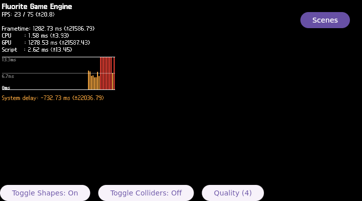

# FLR-0030 — capture present-boundary fault symbol/core

- Status: Done
- Priority: High
- Owner: runtime diagnosis + target-validation roles
- Depends on: FLR-0029
- Links: [FLR-0029](FLR-0029-present-boundary-page-fault.md), [FLR-0028](FLR-0028-production-shape-light-coenabled.md)
- Working log: `work/logs/2026-09-06-flr0030.md`
- Follow-up: [FLR-0031](FLR-0031-isolate-lit-light-trigger.md)

## Problem

FLR-0029 reproduced a page fault in `FEngine::loop` immediately after `FLR0026_VK_QUEUE_PRESENT_BEGIN`. The image has GDB, eu-stack, and systemd-coredump, but batch GDB did not produce a backtrace before the fault repeated.

## Purpose

Capture a symbolized fault or core/backtrace and decide whether the first owned fault is in the userspace FEngine/Filament/Vulkan path, guest kernel reporting, or the diagnostic harness.

## Success measure

- Reuse the exact image/profile and existing receiver/build/TMPDIR/container.
- Use one bounded diagnostic method at a time: ptrace/GDB stop-on-signal, core extraction, or loaded-map capture.
- Map the instruction pointer to a library and symbol, and record whether source/debug-line resolution is available.
- Compare the result with FLR-0027 shape-only/light-only and FLR-0028 co-enabled evidence.
- Attach/embed the QMP photograph and close this ticket before any source patch; a selected patch becomes FLR-0031.

## Scope

### In scope

- Read-only inspection of the existing FLR-0029 logs and installed debug tools.
- One controlled runtime capture if needed to obtain a symbol/core/backtrace.
- Minimal Devtool diagnostic patch design only after the fault owner is known.

### Out of scope

- Production behavior changes, Planetarium navigation, compositor redesign, cache deletion, new container, receiver, or TMPDIR.
- Treating the HUD-only QMP frame as a 3D pass.

## Hypotheses

1. The fault is a userspace FEngine/Filament/Vulkan WSI instruction after present begins.
2. The guest reports a userspace fault but systemd-coredump or ptrace handling prevents the first backtrace.
3. The diagnostic harness itself changes timing and the fault is not attributable without a non-invasive map/core capture.

## PDCA

### Plan

- Start from FLR-0029 facts; do not create a source patch first.
- Select one capture method and preserve the QMP image, serial, and teardown evidence.

### Do

- Collect exact maps/symbol/core evidence and compare the first divergence.

### Check

| Criterion | Expected | Actual | Evidence | Result |
| --- | --- | --- | --- | --- |
| Fault symbol | instruction pointer mapped to library/symbol | RIP `0x7fafecda5541` mapped through `/usr/lib/libLLVM.so.18.1` to `llvm::CmpInst::isOrdered`; host disassembly confirms offset `0xb1d541` is one byte into the function | attach maps, guest `eu-addr2line`, Mini PC `nm/objdump` | PASS — ownership boundary mapped |
| Source/debug line | source file and line available | symbol name available; `eu-addr2line` returned `??:0`, and no matching `.debug` file exists in the authoritative build outputs | guest symbol lookup, build artifact inspection | UNKNOWN — debug line/source unavailable |
| 3D result | QMP photo states visible native result | 720x400 HUD-only frame; native region remains black | `../evidence/flr0030/attach-late.png`, PNG SHA-256 `4b7f4270262d786b4a3b09a0ff3770ef7851c520fa7cd4fe10284a96131312ae` | FAIL — 3D not shown |
| Teardown | QMP quit and no residual process | QMP quit acknowledged, socket absent, no actual QEMU/Flutter/Weston process remained | QMP/serial evidence | PASS |

### Act

- Close this ticket after symbol ownership is classified.
- Continue with [FLR-0031](FLR-0031-isolate-lit-light-trigger.md). No production behavior change is claimed by this ticket.

## Unknowns

- Faulting source/debug line: UNKNOWN because the image/build does not contain line-level debug information.
- Whether a source change is needed: UNKNOWN.
- Whether the eventual patch produces visible production 3D: UNKNOWN.

## Facts

- The attach run kept one QEMU instance and attached GDB to `flutter-auto` before the first frame. The main thread was in `ppoll`; other Flutter and llvmpipe threads were waiting in futex calls.
- After `FLR0026_VK_QUEUE_PRESENT_BEGIN`, the guest reported `CPU: 0 PID: 684 Comm: FEngine::loop`, `RIP: 0033:0x7fafecda5541`, `RSP: 002b:0x7faf8eff9750`, and `CR2: 0x7faf8eff9750`.
- `/proc/<pid>/maps` placed the executable LLVM mapping at `.../libLLVM.so.18.1`. The relative offset is `0xb1d541`.
- Guest `eu-addr2line` resolved the address to `llvm::CmpInst::isOrdered(llvm::CmpInst::Predicate)` but had no source line. Authoritative Mini PC symbols place `isOrdered` at `0xb1d540`; disassembly shows the fault is at the second byte of its first instruction, not at a normal function entry.
- The attach QMP image is HUD-only. Its serial SHA-256 is `6ec1a5dcd2e1236d220125d2093de411c7e140029222c36d1f3b6c526466de91`; the QMP quit evidence SHA-256 is `511117bfd4ec27607ee752999f10a4d8140f6af90a40f26fe25b838609d6bb8c`.

## Inferences

- The first mapped fault boundary is in the userspace LLVM library reached by the llvmpipe/Vulkan path, not in QMP capture or Wayland photo acquisition.
- A RIP one byte into `isOrdered` is more consistent with corrupted control flow, return state, or an invalid indirect target than with the ordinary boolean logic of `isOrdered`. This is a boundary inference, not a root-cause proof.

## QMP-only photograph

The frame contains the CPU/GPU/frametime HUD and no visible native 3D geometry. The repository-copy PNG SHA-256 is `4b7f4270262d786b4a3b09a0ff3770ef7851c520fa7cd4fe10284a96131312ae`.
