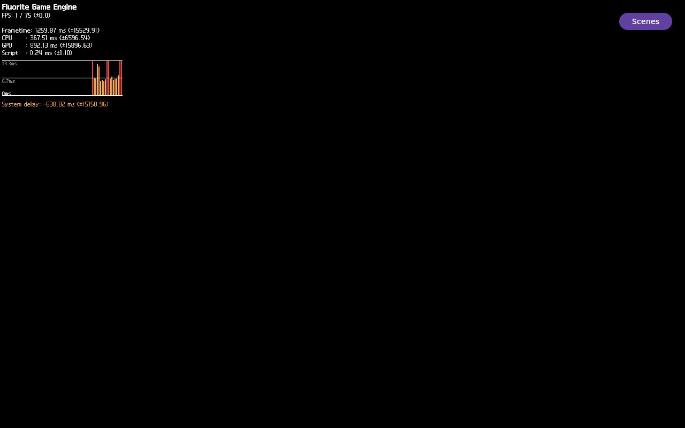

# FLR-0341 — capture the Lavapipe wait caller and submit-to-Present chain

- Status: Done
- Priority: High
- Owner: production FEngine / Filament Vulkan / Lavapipe runtime roles
- Created: 2026-09-28
- Predecessor: [FLR-0340](FLR-0340-map-present-wait-semaphore-source.md)
- Baseline run: [FLR-0339 run 0001](FLR-0339-capture-vulkan-present-stall-stack.md)
- Working log: `work/logs/2026-09-28-flr0341.md`
- Run ID: `flr0341-0001` (one QEMU attempt only)

## Objective

On the exact FLR-0335/0339 image, determine whether the FEngine threads in
Lavapipe synchronization are on the `vkQueuePresentKHR` route or an independent
queue-submit/fence route, and compare the runtime submit-signal semaphore handle
with the handle consumed by Present. This is a runtime evidence task only; it
does not change source or rebuild the image.

## Bounded result

The exact-image run reproduced the Present stall and captured the missing WSI
caller. The second `FLUORITE_VK_SUBMIT_RETURN` signal handle is identical to the
handle in `FLUORITE_VK_PRESENT_CALL_BEGIN` and
`FLUORITE_VK_QUEUE_PRESENT_ENTER`; the Present call still has no return. The
selected GDB command expired at its 20-second timeout (exit 124), but captured
the FEngine stack through Lavapipe `lvp_pipe_sync_wait` into
`wsi_common_queue_present` and detached the inferior.

QMP shows the colored 2D HUD/Scenes button, but the entire lower 3D ROI is
uniform black in the full screenshot and all eight captured frames. This run
therefore locates a Present/WSI stall; it does not demonstrate a lighting or
texture failure and does not explain the historical colored Sequoia frame.

- [Eight-frame QMP sequence](../evidence/FLR-0341-qmp-run-0001-sequence.mp4)
- PNG SHA-256: `e95895de4793a6b727aeb1ecb138f1a5e0c8b38a1c9fc433045ef93116f09457`
- MP4 SHA-256: `87559f7c3bb693c75ff7f86dad4b75de2a866a6d40ff5366962974b5d2cf8053`

## Success criteria

- Revalidate the rootfs, qemuboot, and kernel hashes before starting one QEMU.
- Capture QMP-only full-frame evidence and the fixed eight-frame sequence; record
  the full-frame and lower-3D-ROI analysis, whether or not 3D appears.
- At the first Present-enter/no-return boundary, preserve only the selected
  `FEngine::loop` thread stacks: at most eight frames for candidates, then at most
  24 frames only for a stack containing `lvp_pipe_sync_wait`.
- Capture the bounded runtime markers `FLUORITE_VK_SUBMIT_RETURN`,
  `FLUORITE_VK_PRESENT_CALL_BEGIN`, `FLUORITE_VK_QUEUE_PRESENT_ENTER`, and
  `FLUORITE_VK_QUEUE_PRESENT_RETURN`; compare the semaphore values literally.
- Stop the recorded app, QMP-quit the recorded VM, and prove zero residual
  QEMU/runqemu/flutter-auto processes and QMP socket.
- If the boundary does not occur, a target stack cannot be selected, or a
  diagnostic marker is absent, retain that as the bounded result and stop; do
  not retry this ticket.

## Inherited facts

- The exact saved `runqemu` inputs for FLR-0339 re-hashed to the recorded
  FLR-0335 rootfs, qemuboot, and kernel digests. Do not use the distinct newer
  deploy candidate inspected during FLR-0340.
- FLR-0339 showed HUD/metrics/Scenes and 768,000 black pixels in the lower 3D
  ROI; Present-enter had no return. Its partial GDB trace reached Lavapipe
  `lvp_pipe_sync_wait_locked` with `VK_SYNC_WAIT_PENDING`, but stopped before the
  caller frames.
- FLR-0340 mapped Filament source from queue-submit signal through
  `acquireFinishedSignal()` to Present's wait list. The two retained runtime
  Present markers carry the same handle, but the captured serial output did not
  include the matching submit-return handle.
- **FLR-0342 correction:** the hash-identified runtime ELF reaches `cnd_wait`
  before its `VK_SYNC_WAIT_PENDING` test, consistent with the archived Mesa
  24.0.7 source. The `signaled`/`fence` field values were not read directly.
  The similarly named `vk_queue_wait_before_present()` is an ANV helper, not
  Lavapipe evidence; FLR-0343 observes the exact wait object's state/writer.
- Historical FLR-0070 p9 recorded simultaneous HUD+Sequoia pixels, but the QMP
  frame is missing at its documented Mini path; its image hash and pixel summary
  remain recorded. FLR-0071 did not reproduce that positive result.

## Ranked hypotheses

1. The Lavapipe wait is reached while WSI processes Present or its internal
   submit. Prediction: a selected stack contains `wsi_QueuePresentKHR`,
   `wsi_common_queue_present`, or a directly nested queue-submit frame.
2. The Lavapipe wait is an independent queue-submit/fence operation. Prediction:
   the selected stack reaches queue-submit worker/fence code without WSI frames.
3. Filament submits the signal but the runtime handle does not match the
   semaphore passed to Present. Prediction: submit-return and Present handles
   differ or the expected submit-return marker is absent before Present-enter.
4. The capture is in a separate idle/synchronization FEngine thread. Prediction:
   the Lavapipe wait is not on the thread associated with the Present markers.

## 4W1H (Why intentionally excluded)

| Dimension | Target |
| --- | --- |
| What | Present-enter/no-return and exact Lavapipe caller; submit signal vs wait handle |
| When | First Present-enter, then a two-second no-return grace |
| Where | Fixed Mini QEMU image and production Example Demo |
| Who | FEngine threads, Filament Vulkan backend, Lavapipe/WSI roles |
| How | One selected-thread GDB capture, a narrow marker slice, and QMP-only frames |

## Scope and controls

### In scope

- One new evidence directory and one QEMU instance on the fixed Mini runqemu
  flow, using 6144 MiB and the exact FLR-0335 image hashes.
- Reuse the existing QEMU runtime harness and QMP pixel-capture helper; do not
  create a second build/TMPDIR or copy a QEMU disk image to Mac.
- Reuse the FLR-0339 production launch profile unchanged. Capture only the
  selected Present/synchronization markers and bounded thread stacks.
- Keep raw QMP/GDB/runtime artifacts on Mini. A screenshot/video copy for
  display in this conversation is allowed; no rootfs/kernel/qemuboot transfer.

### Out of scope

- Devtool, `do_patch`, BitBake, image changes, source or patch edits.
- Light, camera, material, texture, model, HUD, or scene changes.
- Broad logs, `thread apply all bt`, unbounded GDB, full `strace`, or a second
  QEMU attempt.

## PDCA

### Plan

1. Verify canonical repo, sole active ticket, checkpoint, and no residual Mini
   QEMU/app processes; confirm exact image hashes and available run slot.
2. Stage the ticket's bounded run/guest commands in the fixed Mini evidence
   directory. Validate helper hashes and the 4096-byte guest-command limit.
3. Start one QEMU from the saved exact runqemu arguments; capture a QMP
   pre-launch frame, run the unchanged production profile, and poll only the
   Present-enter/return boundary.
4. If stalled, attach GDB once. Enumerate only threads named `FEngine::loop`,
   capture at most eight frames per candidate, and expand only a stack containing
   `lvp_pipe_sync_wait` to 24 frames. Bound the attach at 20 seconds.
5. Capture the four selected Vulkan semaphore/present markers, a QMP full frame,
   eight one-second QMP frames, and lower-ROI analysis. Stop the exact app and
   QMP-quit the VM; require zero residual processes/socket.
6. Record hashes, success/failure, facts, inferences, UNKNOWN, and next
   falsifiable gate; do not patch or rebuild from this run alone.

### Check

| Criterion | Expected | Actual | Result |
| --- | --- | --- | --- |
| Repository / ticket gate | Canonical guard, sole active ticket, checkpoint contracts | PASS; both FLR-0340/0341 contracts verified | PASS |
| Local harness validity | Repo gates, guest syntax/GDB Python parse, serial size | `make verify` passed; all commands parse and stay below 4096 bytes | PASS |
| Mini runner transfer | Eight committed runner files match local hashes; no image/source transfer | Remote hashes matched; remote syntax, size, and file-count checks passed | PASS |
| Exact image identity | Three hashes match FLR-0335 | Kernel/rootfs/qemuboot all matched the saved FLR-0335 inputs | PASS |
| Mini process/resource preflight | No process/port/evidence collision | 0 target processes; ports 10930–10932 free; no evidence collision; 68,493,804 KiB disk and 28,294,572 KiB MemAvailable | PASS |
| Runtime boundary | Present-enter and return/grace outcome recorded | enter=1, return=0 after the two-second grace; app remained alive | PASS (stall reproduced) |
| Selected stack | WSI vs queue/fence caller, or explicit UNKNOWN | FEngine thread 25 stack reached `lvp_pipe_sync_wait` → `wsi_common_queue_present`; GDB timed out at 20s after detaching | PARTIAL (caller captured) |
| Handle continuity | Submit-return vs Present handles compared | Second submit returned `0x7f2cac025a40`; Present waited on the same handle; return code/result=0 | PASS (identity matched) |
| Visual evidence | QMP full frame, 8-frame sequence, 3D ROI metrics | HUD frame captured; lower 768,000-pixel ROI black with 0 changed/chromatic pixels in screenshot and every frame | PASS (3D absent) |
| Teardown | App/QEMU/runqemu/socket all absent | app stop PASS; flutter=0; QMP quit accepted; residual targets/socket=0 | PASS |

### Act

- Close this bounded runtime unit: the WSI caller and submit-to-Present handle
  equality are established, but signal completion and causal relation to black
  3D remain UNKNOWN.
- FLR-0342 corrected the pending/fence interpretation against the exact Mesa
  source and runtime ELF; FLR-0343 owns the signal/fence producer-state probe.

## UNKNOWN

- Whether the exact downstream Mesa implementation changes the pending/fence
  path.
- Whether a matching submit-return semaphore has completed its signal operation
  before Present blocks, and why `wsi_common_queue_present` remains there.
- Whether resolving this WSI wait restores visible 3D pixels or relates to the
  historical colored Sequoia/HUD frame.
