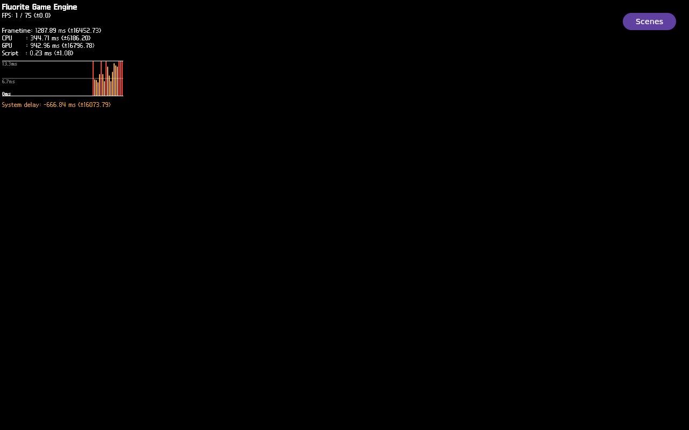

# FLR-0343 — observe the Lavapipe Present-wait sync object and producer

- Status: Waiting
- Priority: High
- Owner: Lavapipe sync-object and Vulkan WSI runtime roles
- Created: 2026-09-28
- Predecessor: [FLR-0342](FLR-0342-inspect-mesa-pending-wait-binary.md)
- Baseline image: FLR-0335 kernel/rootfs/qemuboot hashes in FLR-0341
- Run ID: `flr0343-0001` (one QEMU attempt only)
- Working log: `work/logs/2026-09-28-flr0343.md`

## Objective

On the exact FLR-0335 production image, read the Lavapipe sync object's
`signaled` and `fence` fields at the `VK_SYNC_WAIT_PENDING` wait, relate that
object to the Vulkan semaphore handles using debug type/layout evidence, and
observe a bounded write to either field. Capture the writer's thread and short
stack, or record a bounded no-hit result. Preserve QMP-only full-frame evidence
for the same run. This is runtime instrumentation only; it does not change the
image, source, patch stack, or build state.

## Success criteria

- Before starting, verify the exact FLR-0335 image hashes, Mini process/port
  preflight, one evidence-directory slot, and sufficient memory/disk headroom.
- Reuse the unchanged FLR-0341 production launch/profile and 6144 MiB QEMU
  memory setting. Start exactly one QEMU with the existing fixed `runqemu`
  harness; do not create another build/TMPDIR or transfer an image to Mac.
- At the selected `lvp_pipe_sync_wait_locked` frame, capture the exact `sync`
  pointer, `signaled`, `fence`, `wait_flags`, and a type/layout-based mapping
  (or explicit UNKNOWN) to the semaphore handles from the same runtime log.
- Arm address-specific write watchpoints for the two fields for at most eight
  seconds. Capture the first writer TID and at most twelve stack frames, or
  record that no watchpoint fired during the complete bounded interval and
  print the fields/caller state after interrupt. A timeout is not proof that no
  producer exists outside that window.
- Capture a QMP-only full-frame screenshot, the fixed eight-frame sequence,
  screenshot/video hashes, and full-frame/lower-3D-ROI pixel summaries whether
  the scene is black or visible. Keep raw evidence in the ticket's single
  evidence directory; link/attach the QMP PNG here after capture.
- Stop the recorded app and QEMU through the existing guest stop/QMP `quit`
  path, then prove zero matching QEMU/runqemu/flutter-auto processes and no
  run-owned QMP socket.
- Record command results, instrumentation effects, failures, UNKNOWNs, and the
  next independent gate. Do not patch, run BitBake/Devtool, disable the HUD, or
  change camera/light/material/scene in this ticket.

## Inherited facts

- FLR-0341 reproduced Present-enter/no-return on this exact image. Its selected
  FEngine stack reached `lvp_pipe_sync_wait_locked` at `cnd_wait`, then
  `vk_queue_submit` and `wsi_common_queue_present`.
- The later `FLUORITE_VK_SUBMIT_RETURN` handle matched the Present wait handle.
  The logged handle and captured sync pointer differed by 88 bytes. Exact
  runtime-ELF DWARF places `vk_semaphore.permanent` at offset 88 and
  `lvp_pipe_sync.base` at offset 0; this matches the observed pointer delta.
  The conversion semantics and same-run identity still need a fresh runtime
  confirmation.
- FLR-0342 matched the runtime Lavapipe ELF and source archive and corrected
  the pending-wait interpretation: `cnd_wait` occurs before the pending-flag
  test. It did not read the live fields or identify a writer.
- FLR-0341 QMP showed the 2D HUD and a uniformly black lower 768,000-pixel 3D
  ROI in the screenshot and eight-frame sequence. This run must recapture its
  own QMP evidence; the predecessor image is not proof for this run.

## Ranked hypotheses

1. **A producer writes one of the exact wait object's fields during the
   observed stall.** Prediction: an address-specific watchpoint fires and the
   stop identifies the writing TID/stack; whether it also wakes the waiter is
   separately observed.
2. **Neither field is written during the bounded window.** Prediction: the
   waiter remains in the condition wait and both values remain unchanged for
   eight seconds. This narrows the missing event but does not identify why the
   producer did not run.
3. **The `sync` pointer is the `permanent` member of the logged semaphore.**
   Prediction: in the new run, the handle plus the DWARF-identified 88-byte
   member offset equals the GDB `sync` pointer. A mismatch falsifies this
   mapping; address proximity alone is not enough.

## 4W1H (Why intentionally excluded)

| Dimension | Target |
| --- | --- |
| What | Lavapipe Present wait and exact sync field transitions |
| When | First reproduced Present-enter/no-return; eight-second watch window |
| Where | Mini `runqemu`, FLR-0335 image, production Example Demo |
| Who | FEngine/Filament submit, Lavapipe sync, and Vulkan WSI roles |
| How | One selected-thread GDB attach, two address-specific watchpoints, QMP full frame/video |

## Scope and controls

### In scope

- One evidence directory and one QEMU run using the exact FLR-0335 image and
  the existing Mini runtime/QMP harness.
- Reuse the proven FLR-0341 app launch and capture only the selected Vulkan
  markers, waiter state, first field writer, and QMP pixel evidence.
- Keep GDB attached for a bounded eight-second watch interval; account for
  debugger/watchpoint timing perturbation in the conclusion.

### Out of scope

- Devtool, `do_patch`, BitBake, source/patch/recipe/image changes, and bundle
  transfer.
- HUD suppression, scene transition, camera/light/material changes, or a
  second QEMU run. A HUD-off/composition A/B is a separate ticket if the
  producer trace does not explain the missing production pixels.
- Broad `thread apply all`, unbounded GDB, broad system logs, global process
  kills, or deletion/cleanup of unrelated evidence.

## PDCA

### Plan

1. Verify the canonical repository, this sole active ticket, command syntax,
   exact artifact hashes, Mini process/port preflight, and evidence slot.
2. Prepare and validate one bounded guest GDB command that finds the wait
   frame, prints its two fields and handle mapping, arms two write watchpoints,
   and records only the first writer TID/stack. The guest wrapper waits for the
   armed marker and enforces an eight-second maximum from `/proc/uptime`.
3. Stage only the ticket runner/guest commands; verify remote hashes and
   command-size limits before QEMU starts. Keep each serial command to one line
   and at most 4096 bytes; transfer the GDB command compressed and verify its
   SHA-256 after decompression.
4. Start the exact image once, reproduce Present-enter/no-return, arm the
   watchpoints, and retain either a writer stack or an explicit eight-second
   no-hit result.
5. Capture a full QMP frame and eight-frame sequence; analyze the same fixed
   3D ROI and hash the artifacts.
6. Stop the recorded app and QMP-quit the same VM; verify no matching runtime
   process/socket remains. Record the result and create the next ticket before
   a different experiment.

### Check

| Criterion | Expected | Actual | Result |
| --- | --- | --- | --- |
| Canonical/ticket gate | Canonical guard, one In Progress ticket, checkpoint valid | Guard and checkpoint contract passed; 0344 is now the sole active ticket | PASS |
| Runner/GDB command | Shell/Python syntax, one-line serial commands <=4096 bytes, bounded watch, no broad thread/log capture | Static and repository-wide checks passed; runtime exposed a 10-second arm timeout and missing failure transcript | FAIL |
| Exact image/preflight | FLR-0335 hashes match; no process/port/evidence collision | Launcher hashes/preflight passed; Mini had zero prior runtime processes/port listeners and sufficient headroom | PASS |
| Sync identity/state | Type/layout mapping and both field values or explicit UNKNOWN | GDB script installed, but no armed marker/field transcript; runtime state is UNKNOWN | UNKNOWN |
| Watch window | First writer stack or complete eight-second no-hit result | Watchpoints never reached the armed state; no eight-second observation occurred | FAIL |
| Visual evidence | QMP full frame + eight frames + hashes + fixed ROI analysis | Full frame and eight QMP frames saved; HUD ROI has 5,314 chromatic pixels, lower 768,000-pixel 3D ROI is uniformly black | PASS (3D absent) |
| Teardown | App/QEMU/runqemu/socket absent | Recorded app stopped, QMP quit accepted; runner verified zero residual targets and no QMP socket | PASS |

### Act

- Wait for FLR-0344 to make asynchronous GDB attach, arm polling, and failure
  transcript capture deterministic. Do not infer a producer result from this
  attempt; the eight-second watch window never started.
- After FLR-0344 obtains live field/producer evidence, select a separate
  production-render discriminator. No HUD-off, camera, light, or texture test
  was performed here.

## Facts

- See the working log for current preflight and inherited runtime evidence.

## Inferences

- The present wait is a concrete candidate boundary for the missing production
  frame, but causality is not yet established.

## UNKNOWN

- Live field values, fresh-run semaphore-to-sync mapping, producer/wakeup
  stack, whether the waiter returns, and why GDB did not emit its armed marker.
- The guest GDB log was under `/run/user/1001`; only its SHA-256 was preserved
  before QEMU teardown, so its error text is unavailable. The selected serial
  transcript shows GDB PID 866 followed by `armed-marker-not-observed-within-10s`.
- This run does not establish whether hiding the HUD reveals Sequoia; HUD
  suppression was intentionally out of scope.

## Visual evidence

- QMP source PPM SHA-256:
  `1880536bb51b8004f3b0952ea111d7be7c50484fc458f8b3f875fb5513cad704`.
  It matches the Mini-side QMP analysis. Full frame: 9,617 changed pixels and
  5,314 chromatic pixels, all bounded to the upper HUD area (`y <= 193`).
- Lower ROI `[0,200,1280,600]`: 768,000 black pixels, zero changed/chromatic
  pixels; ROI SHA-256 `0d2039545940e7775d22c8d82079282c91be29af0203faa77e2bff78a67bed0f`.
- All eight one-second QMP frame PPMs have the same full-frame SHA as the
  screenshot; the QMP-only MP4 is 1280x800, 1 fps, 8 frames, 8 seconds.
- 
- [QMP eight-frame video](../evidence/FLR-0343-qmp-run-0001-sequence.mp4)
- This is HUD-only, not the earlier colored Sequoia image. Do not substitute
  the Photo 1 GLB texture or a prior run for this framebuffer evidence.
