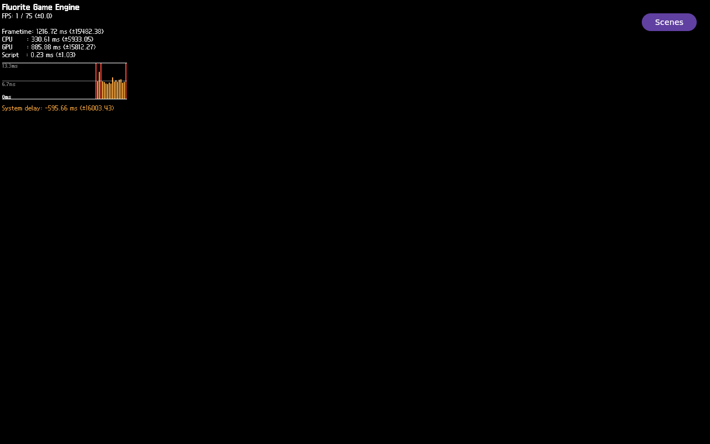

# FLR-0344 — make the Lavapipe GDB watch capture deterministic

- Status: Waiting
- Priority: High
- Owner: GDB runtime instrumentation / Lavapipe sync object / Vulkan WSI roles
- Created: 2026-09-28
- Predecessor: [FLR-0343](FLR-0343-observe-lavapipe-sync-producer.md)
- Baseline image: exact FLR-0335 image hashes, recorded in FLR-0341
- Run ID: `flr0344-0001` (one QEMU attempt only)
- Working log: `work/logs/2026-09-28-flr0344.md`

## Objective

On the exact FLR-0335 production image, make the GDB observation of the
Lavapipe Present-wait sync object bounded and evidence-complete. Separate GDB
launch, armed-marker polling, and the eight-second watch window so thread/frame
search time is not confused with observation time. Persist selected GDB
success/error/stack output into the Mini run directory over serial before
guest teardown. If armed, read `signaled` and `fence`, validate the semaphore
layout mapping, and capture the first writer TID/short stack or an explicit
bounded no-hit result. Capture fresh QMP-only frame/video evidence.

## Success criteria

- The canonical guard and checkpoint contract pass; this is the sole active
  ticket. Mini preflight confirms no existing runtime process, QMP port
  listener, run-directory collision, or resource shortage.
- Transfer only the committed ticket runner/guest commands. Verify remote
  SHA-256, shell syntax, and one-line serial commands at most 4096 bytes.
- Reuse the exact FLR-0335 kernel/rootfs/qemuboot image hashes, FLR-0341
  production Example Demo launch profile, `runqemu` harness, and 6144 MiB
  memory setting. Do not rebuild or create a new TMPDIR.
- When Present-enter/no-return is observed, launch GDB in a recorded
  background process. Poll for `FLR0344_WATCHPOINTS_ARMED=1` in a separate
  serial command bounded below 30 seconds. If it exits or the marker is absent,
  interrupt only its recorded PID and print a selected bounded transcript
  (FLR markers, errors, ptrace/symbol failures, and at most 80 GDB lines) into
  the host-persisted serial evidence.
- Start the write-watch interval only after the armed marker. Bound it to at
  most eight seconds from guest uptime. Capture the first writer TID and at
  most twelve frames, or a complete no-hit interval with post-interrupt fields.
- Capture a fresh QMP-only full frame plus eight one-second frames; preserve
  hashes and full/lower-3D-ROI pixel summaries whether black or visible.
- Stop the recorded app, QMP-quit the same QEMU, and verify zero matching
  processes and no run-owned QMP socket. Do not retry in this ticket.
- Do not patch source, run Devtool/BitBake, rebuild, suppress the HUD, or alter
  scene/camera/light/material/texture variables.

## Facts inherited from FLR-0343

- The exact FLR-0335 image and production launch pass; Vulkan Present enters
  once and does not return during the bounded observation. Submit-return and
  Present-wait semaphore values match.
- QMP shows chromatic 2D HUD pixels in the upper 193 rows and a uniformly black
  lower 768,000-pixel 3D ROI across the full frame and all eight frames.
- The diagnostic GDB script installed successfully, but its wrapper waited
  only ten seconds for the armed marker, then interrupted/terminated GDB PID
  866. The next bounded poll saw GDB exited. No field values or watchpoint hit
  were obtained.
- The guest GDB log was stored under `/run/user/1001`; only its SHA-256 reached
  persistent evidence. Its failure text was lost when QEMU exited. Therefore
  the cause of the arm failure is UNKNOWN.
- FLR-0342 static DWARF still supports the 88-byte semaphore member mapping,
  but it has not been validated in a fresh live run.
- Historical FLR-0070 p9 logged HUD and non-black Sequoia candidate pixels in
  the same QMP frame under a one-light operation-trace profile (`5510/223200`
  candidate and `3961/100000` HUD pixels). Its no-trace control and later
  replays did not reproduce the result; treat it as an unstable diagnostic
  observation, not the current success baseline. The raw frame was absent from
  the documented Mini evidence path checked during FLR-0344.
- The user's square Photo 1 is the static `HeadLights_Emission` GLB texture
  atlas (SHA-256 recorded in FLR-0323), not a runtime QMP frame. FLR-0334/0337
  reached texture-ready/applied markers while QMP still showed a black vehicle
  ROI, so a missing texture file/path is not the leading current explanation.

## Ranked hypotheses

1. **GDB thread/frame search exceeded the old ten-second arm deadline.**
   Prediction: GDB remains alive while the marker is absent, then emits the
   marker when given a longer separate arm-poll interval.
2. **GDB exits early on a debugger, ptrace, symbol, or command error.**
   Prediction: the new persisted serial transcript includes the specific error
   before teardown; an absent armed marker will no longer erase the evidence.
3. **The selected waiter frame/locals cannot be resolved in this image.**
   Prediction: the script reports a bounded frame/variable failure rather
   than an ambiguous timeout, and records no watch window.

## 4W1H (Why intentionally excluded)

| Dimension | Target |
| --- | --- |
| What | GDB attach/arm lifecycle, sync fields, and first producer write |
| When | One reproduced Present-enter/no-return; eight seconds after armed marker |
| Where | Mini `runqemu`, exact FLR-0335 production image and Example Demo |
| Who | GDB, FEngine submit, Lavapipe sync, and Vulkan WSI runtime roles |
| How | Separate launch/arm/watch serial commands, selected persistent transcript, QMP frame/video |

## PDCA

### Plan

1. Read FLR-0343's command/log failure and confirm its QMP media/hash before
   editing the follow-up runner.
2. Implement separate one-line GDB launch, bounded arm poll, and bounded watch
   window commands. Ensure every GDB exit/error is printed to serial and
   captured in the persistent Mini transcript.
3. Run local canonical/privacy/syntax/size/repository gates; commit locally;
   transfer only committed diagnostics and verify all remote hashes.
4. Recheck Mini process/ports/resources and exact FLR-0335 artifacts; perform
   exactly one QEMU run.
5. Preserve QMP full-frame/eight-frame evidence and pixel analysis; perform
   exact recorded-app/QMP teardown; document all failures and UNKNOWNs.

### Check

| Criterion | Expected | Actual | Result |
| --- | --- | --- | --- |
| Canonical/ticket gate | Guard and one active ticket | PASS | Canonical guard passed; FLR-0343 is Waiting and FLR-0344 is sole In Progress |
| Runner/log gates | Separate bounded phases; serial transcript preserves failure | PASS | GDB launch/arm/watch split; zombie-aware process checks; bounded error detail/transcript; local checks and `make verify` passed; production profile matches FLR-0343 after ticket-ID normalization |
| Committed diagnostic transfer | Only committed commands; remote hashes, shell syntax, and command limits pass | PASS | 13 FLR-0344 command files match local committed hashes; both shell runners parse; all 10 serial commands are one line and ≤4096 bytes |
| Mini/image preflight | Exact hashes; process/port/slot/resource checks pass | PASS before start | Final read-only preflight: exact kernel/rootfs/qemuboot hashes; 0 target processes; 0 listeners on ports 10930–10932; run slot clear; evidence free 68,383,296 KiB; MemAvailable 28,284,260 KiB. Launcher rechecks before QEMU start |
| GDB state | Armed fields/mapping plus hit/no-hit, or explicit persisted failure | FAIL / follow-up | GDB launched, but arm waiter immediately returned `missing-gdb-state`; no sync fields or writer captured. FLR-0346 owns the wait-helper defect |
| QMP visual evidence | Full frame, eight frames, hashes, fixed ROI | Captured; production 3D FAIL | Full QMP HUD frame saved; chromatic HUD is confined to y≤193; lower ROI is exactly 768,000 black pixels in still and all eight frames |
| Teardown | App/QEMU/runqemu/socket absent | PASS | Recorded app stopped, QMP quit accepted, runner and independent checks reported zero residual targets/socket |

### Act

- If a producer writer is captured, create a separate ticket for the narrowest
  source/runtime correction and validate through Mac Devtool → layer commit →
  Mini bundle/build → QMP.
- If GDB fails again, retain its exact bounded transcript and choose the next
  instrumentation path from that evidence; do not add a guessed patch.
- If the sync wait completes but QMP remains HUD-only, open a separate
  production-surface/render discriminator. A HUD-off A/B is a distinct ticket
  and is not implied by this run.

## Facts

- See `work/logs/2026-09-28-flr0344.md` for command results and hashes.

## Inferences

- Separating attach/arming from the watch interval prevents setup latency from
  silently consuming the observation window.

## UNKNOWN

- Why FLR-0343 GDB did not emit the armed marker; whether sync fields change;
  semaphore-to-sync live identity; producer TID/stack; and whether the wait
  accounts for the black 3D ROI.

## Visual evidence

- Fresh QMP-only FLR-0344 run `flr0344-0001`, 1280×800. The Fluorite HUD,
  CPU/GPU/FPS metrics, graph, and Scenes button are visible; the 3D ROI
  `[0,200,1280,600]` is uniformly black (768,000/768,000 pixels). This does
  not test HUD-off Sequoia.
- Full-frame PNG SHA-256:
  `e610c90081a7496a51a8f6502d090ca40b26bffb0fe0a9d65ef9a1973fa470d1`.
  The eight-frame QMP video is 1280×800, 1 fps, 8 seconds; SHA-256
  `7a98230d11690cc852fc7ca55c4630a909ca7228d23e8c6ccea939d69fd03234`.
  All eight source PPM frames matched
  `5e7c5807850297afae076b7ceb770141542adbbcc48ea5c60e8bf03669dce66a`.
- 
- [QMP eight-frame video](../evidence/FLR-0344-qmp-run-0001-sequence.mp4)
- Only QMP still/video media was transferred for display; no QEMU image was
  copied to Mac.

## Follow-up after FLR-0345

- The retrospective in [FLR-0345](FLR-0345-retrospective-3d-visibility-checklist.md)
  completed as local commit `fe85290`. It selects this exact same-image
  Present-wait capture as the next discriminator; HUD-off remains a separate,
  conditional follow-up.
- Static preparation is locally committed as `d892652`; 13 committed
  diagnostic files were transferred and hash-verified. This ticket's one QEMU
  run is complete. The arm-wait command's empty-log race is isolated to
  [FLR-0346](FLR-0346-tolerate-empty-gdb-log-during-arm-poll.md); do not retry
  or modify this ticket.
