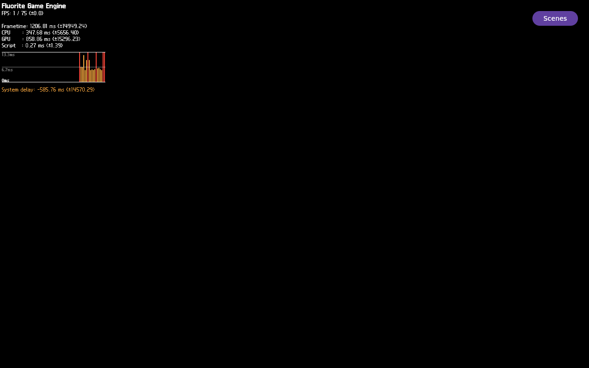

# FLR-0347 — retest the corrected GDB arm-poll on the exact image

- Status: Done
- Priority: High
- Owner: Mini runtime / GDB / QMP evidence roles
- Created: 2026-09-28
- Predecessor: [FLR-0346](FLR-0346-tolerate-empty-gdb-log-during-arm-poll.md)
- Runtime baseline: FLR-0335 exact kernel/rootfs/qemuboot hashes recorded in FLR-0344
- Run ID: `flr0347-0001` (one QEMU attempt only)
- Working log: `work/logs/2026-09-28-flr0347.md`

## Objective

Run the unchanged production Example Demo once on the exact FLR-0335 image,
using the FLR-0346 corrected arm-poll, to determine whether GDB reaches the
watchpoint setup and to preserve a fresh QMP-only full frame/eight-frame video.
This validates a diagnostic helper and captures the current display; it does
not change Fluorite, scene, HUD, camera, Light, material, or texture inputs.

## Facts

- FLR-0344's `flr0344-0001` run used the exact production image and showed
  Present-enter/no-return, visible HUD, and an all-black 768,000-pixel lower
  3D ROI. Its GDB launch passed; the arm waiter returned before polling and
  did not record which initial `-s` predicate failed.
- FLR-0346's local regression proves that the old predicate rejects an
  existing empty log. The corrected helper accepts that state, polls for the
  armed marker, and independently diagnoses absent PID/log files. In this
  run it waited through 44 polls; GDB exited after a concrete watch-setup
  error instead of the old immediate ambiguous rejection.
- The selected Mesa wait thread reported `FLR0344_SIGNAL_INITIAL=false` and
  `FLR0344_FENCE_INITIAL=0x0`. The `sync->signaled` hardware watchpoint was
  created, then the `sync->fence` watch expression failed because GDB had no
  `pipe_fence_handle` type. The watch window therefore did not start and no
  sync-field writer was captured.
- The current production observation does not show Sequoia with or without
  HUD. Historical FLR-0070 candidate pixels are unstable and do not establish
  present-day success.

## Scope

- In scope: minimal runner integration for a new run ID, transfer of committed
  diagnostic scripts only, one exact-image Mini QEMU attempt, bounded GDB arm
  and watch evidence, QMP still/video and ROI analysis, and exact teardown.
- The shared FLR-0344 runner keeps its original run path unchanged; only the
  allowlisted `flr0347-NNNN` branch installs and invokes the FLR-0346 helper.
- Out of scope: image build, Devtool/source patch, copying kernel/rootfs to
  Mac, changing launch arguments or visual inputs, or retrying after this run.

## Success criteria

- Canonical repo and checkpoint guards pass with this as the sole active
  ticket. Local scripts are syntax-checked; every serial command is one line
  and ≤4096 bytes; invalid run IDs remain rejected.
- Only committed diagnostics are transferred; remote hashes match. Mini
  preflight confirms zero target processes/listeners, no run collision, exact
  image hashes, and adequate free memory/storage.
- Exactly one run uses run ID `flr0347-0001`, the unchanged FLR-0341 production
  Example Demo profile, exact FLR-0335 image, 6144 MiB, and no new build.
- The corrected helper is installed and hash-verified in guest runtime state.
  The result records armed/pass, bounded timeout with selected transcript, or
  a specific failure; no ambiguous skipped-poll outcome is accepted.
- QMP full-frame PNG and eight-frame video are captured and hashed; report
  HUD visibility and fixed lower 3D ROI pixels without relying on the host
  desktop screenshot.
- Recorded app, QEMU/runqemu, and run-owned QMP socket are absent after
  teardown. Record every failed command/check and recovery in this ticket log.

## Ranked hypotheses

1. **The earlier arm waiter rejected a newly created empty GDB log.**
   Prediction: the corrected helper enters its bounded poll and either sees
   `FLR0344_WATCHPOINTS_ARMED=1` or returns a specific timeout with transcript.
2. **GDB attach/thread enumeration is slower than the available deadline.**
   Prediction: GDB remains alive and its bounded transcript shows progress,
   but no armed marker before timeout.
3. **The selected waiter frame or locals cannot be resolved.** Prediction:
   the captured transcript records a concrete GDB/Python frame or field error.
4. **The exact image now produces a non-black QMP 3D ROI.** Prediction: fixed
   ROI analysis identifies non-black/chromatic pixels. If not, the all-black
   output remains a separate rendering/composition problem; debugger success
   alone is not display success.

## Plan / Do / Check / Act

### Plan

1. Verify current exact-image/runner provenance and make only the minimal
   runner changes needed for a fresh run ID and corrected helper invocation.
2. Run local syntax, serial command-size, test, privacy, link, and checkpoint
   gates; commit the diagnostic changes locally.
3. Transfer only committed runner/commands/helper to Mini and verify SHA-256,
   syntax, one-line commands, and read-only process/port/resource/image gates.
4. Run once, collect bounded serial/GDB state and QMP full-screen plus eight
   frames, then stop the recorded app and quit the same QMP instance.
5. Verify zero residual targets/socket; copy only QMP media back for review.

### Check

| Gate | Expected | Actual | Result |
| --- | --- | --- | --- |
| Canonical and one-ticket state | Guard passes; FLR-0347 is sole active ticket | PASS | Canonical and FLR-0344/0346/0347 checkpoint verification pass; exactly one active ticket |
| Runner/helper integration | Corrected helper used; commands bounded | PASS locally | Both shell runners parse; all 51 shell files pass syntax; invalid run IDs are rejected; corrected wrapper is one line; compressed helper-install command is 1,383 bytes; the FLR-0347 branch recognizes its own success marker while FLR-0344 retains its legacy marker |
| Transfer and Mini preflight | Committed files/hash/image/process/resource checks pass | PASS | Canonical bundle SHA-256 `543d1dbcd1261d3b31c6c1d5cbec6865702432d5d0c8a1ebda1f07c9ca1aba5d` reached exact receiver tip `9410ffd02374cff20ca05395ee322fb6ae2ef65d`; 15 diagnostic files exist. Read-only preflight: 0 target processes, 0 listeners on 10930–10932, clear run slot, 68,346,232 KiB evidence free, 28,279,112 KiB MemAvailable; exact kernel/rootfs/qemuboot hashes pass |
| Runtime/GDB | One exact-image run; arm and bounded transcript captured | Diagnostic result; watch not armed | Corrected poll waited 44 cycles and captured exact failure `No struct type named pipe_fence_handle`; initial sync snapshot was signaled=false/fence=0; no writer/watch interval |
| QMP evidence | Full still + eight-frame video + fixed ROI analysis | Captured; production 3D FAIL | HUD/metrics/Scenes visible; fixed lower ROI is 768,000/768,000 black with zero chromatic/edge/change pixels. All eight frames identical |
| Teardown | App/QEMU/socket absent | PASS | App stop, QMP quit, runner trap, and independent process/port/socket checks all report zero residuals |

## Visual evidence

- QMP-only full frame PNG SHA-256:
  `4b2d48306e24e04ff3634340d338512799fc2c8ebd066b82666151d8b9862b81`.
- Eight-frame video: 1280×800, H.264, 1 fps, 8 seconds; SHA-256
  `331c38be1e7bcca8aff38fad5cdabff18556071808764f1f0f1a2b120040741d`.
- All eight QMP source PPMs and the still have SHA-256
  `964c79c9e2d77b854b3bea8fa40adbd317e78ff95824367add592d8815182415`.
- Full-frame analysis: 9,401 changed pixels and 5,058 chromatic pixels,
  bounded to the HUD above y=193. The lower ROI `[0,200,1280,600]` is exactly
  768,000 black pixels, luma `[0,0]`, with zero chromatic, edge, or changed
  pixels. This run did not show Sequoia with or without HUD.
- 
- [FLR-0347 QMP eight-frame video](../evidence/FLR-0347-qmp-run-0001-sequence.mp4)
- Only QMP PPM media was streamed back to the Mac for PNG/MP4 encoding; no
  kernel, rootfs, or QEMU disk image was copied.

### Act

- The corrected poll did its job: it exposed a concrete GDB setup defect
  instead of a false missing-state result. [FLR-0348](FLR-0348-watch-lavapipe-signal-without-fence-type.md)
  owns the minimal GDB-script correction and one bounded same-image rerun.
- No renderer/light/camera/HUD fix is justified by this run. The all-black
  production ROI and initial unsignaled sync are facts; their causal relation
  remains UNKNOWN.

## UNKNOWN

- Which runtime role should set `sync->signaled`, whether the wait's false/null
  snapshot persists or later changes, current QMP Sequoia visibility, and
  whether Present-enter/no-return causes or merely coexists with the black 3D
  region.
