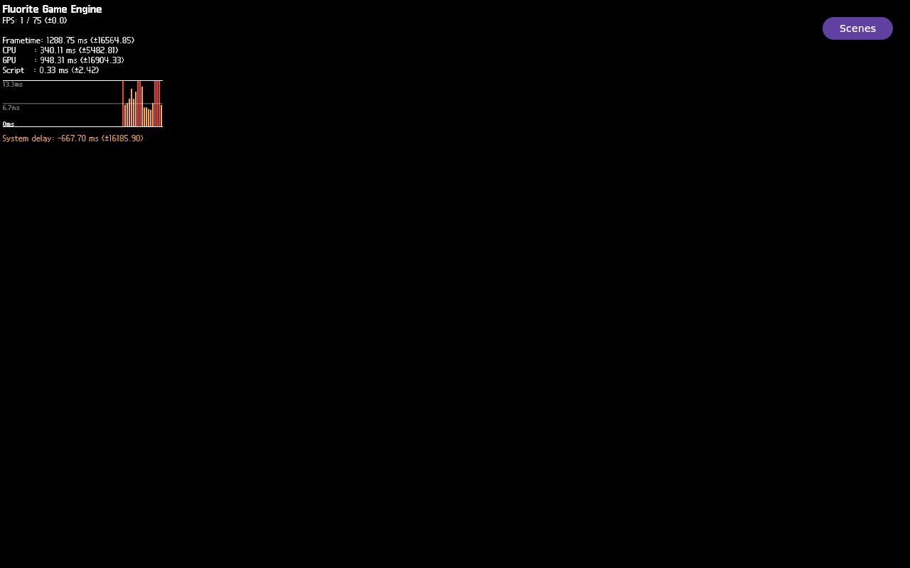

# FLR-0348 — watch both Lavapipe wait-release predicates without fence DWARF types

- Status: Done
- Priority: High
- Owner: GDB instrumentation / Lavapipe sync / Mini QEMU evidence roles
- Created: 2026-09-28
- Predecessor: [FLR-0347](FLR-0347-retest-empty-log-arm-poll-on-exact-image.md)
- Runtime baseline: exact FLR-0335 image hashes, recorded in FLR-0344
- Run ID: `flr0348-0001` (one QEMU attempt only)
- Working log: `work/logs/2026-09-28-flr0348.md`

## Objective

Capture whether either wait-release predicate changes: `sync->signaled`
becomes true or `sync->fence` becomes non-null, and identify the first writer
without making GDB resolve the unavailable `pipe_fence_handle` type. FLR-0342
matched the exact runtime binary to a wait loop that continues only while
both fields are false/null; watching only `signaled` could therefore miss the
event that releases the wait. Keep the same production image and Example Demo.
This is a debugger-script correction only: no layer source, package, image,
scene, HUD, camera, Light, material, or texture changes.

## Facts from FLR-0347

- The corrected empty-log poll ran for 44 polls and preserved the bounded GDB
  transcript instead of returning the old immediate ambiguous failure.
- Present-enter/no-return recurred. GDB resolved the waiter and read
  `sync->signaled=false` and `sync->fence=0x0`.
- `watch -l sync->signaled` succeeded and created hardware watchpoint 1.
  The following `watch -l sync->fence` failed with
  `No struct type named pipe_fence_handle.` The script's exception handler
  aborted setup before emitting the armed marker; no watch interval ran.
- QMP displayed the HUD, but all 768,000 pixels in the fixed lower 3D ROI were
  black across the still and all eight frames. App/QEMU/socket teardown passed.
- The QMP-only screenshot/video are linked in FLR-0347. They are not evidence
  that Sequoia is visible with or without HUD.
- FLR-0342's hash-matched Mesa source/binary evidence shows the wait condition
  is `while (!sync->signaled && !sync->fence)`. Either a true signal or a
  non-null fence pointer ends that wait. The existing signal-only plan is
  incomplete even if the signal watch itself is repaired.

## Competing approaches

1. **Type-independent two-predicate watch (selected):** retain the supported
   `sync->signaled` watch and watch the fence storage through its captured
   address using a built-in raw pointer expression such as
   `*(void **)<fence-address>`. The dedicated FLR-0348 script emits each
   registration result, the GDB watchpoint number, and the combined armed
   marker only after both are installed. This observes both source-proven
   wait-release conditions without changing image symbols or rebuilding.
2. **Add or repair Mesa fence debug type information:** could support typed
   fence-object inspection, but expands package/image/debug-symbol scope and
   is not needed to detect the non-null pointer transition. Defer unless the
   raw-address watch cannot be installed or interpreted.

## Success criteria

- A local regression/contract test checks the actual GDB script: it installs a
  `sync->signaled` watch and a raw-address watch over the storage for
  `sync->fence`; neither uses the unavailable named fence type, and the
  combined armed marker appears only after both watches are created.
  Existing bounded helper behavior stays unchanged.
- Runner allowlist adds only `flr0348-NNNN`, uses a unique
  `qmp-0348.sock`, and selects the same corrected FLR-0346 arm-poll and the
  dedicated FLR-0348 GDB script. The FLR-0344/0347 run paths remain
  unchanged. Shared guest scratch names retain the established FLR-0344
  namespace; preflight and GDB launch both reject a stale PID/log, and the
  GDB script is installed only after its SHA-256 is verified.
- Local shell/test/privacy/link/checkpoint gates pass; all serial commands
  remain one line and ≤4096 bytes. Commit locally, create/verify the canonical
  bundle, and update the existing fixed Mini receiver only.
- Mini preflight verifies exact image hashes, zero residual targets/listeners,
  clear run slot, and adequate memory/storage. Transfer only committed
  diagnostics; verify remote hashes/syntax.
- Exactly one `flr0348-0001` run records whether both predicate watches arm,
  the watchpoint IDs, any first writer TID/selected stack, or a bounded
  no-hit/error result. The watch window starts only after the combined
  marker. Do not expand the watch interval or retry in this ticket.
- Capture QMP full-frame PNG/eight-frame MP4 and fixed lower-ROI summary;
  verify app/QEMU/QMP teardown independently. No QEMU disk image is copied to
  Mac.

## Ranked hypotheses

1. **One of the two source-proven wait-release fields changes during the
   bounded window.** Prediction: the corresponding watch identifies a writer
   and stack; the log reports which field changed.
2. **Neither field changes during the bounded window.** Prediction: both
   watches arm, no hit occurs, and the final values remain false/null; this is
   a bounded no-hit observation, not proof the fields never change.
3. **The raw-address fence watch cannot be installed.** Prediction: its
   separate setup marker/error identifies the failure while the signal-watch
   result remains preserved; do not claim the wait is instrumented.
4. **The sync observation is independent of production pixel output.**
   Prediction: either watch may arm or hit while the lower ROI remains
   black; keep pixel acceptance as a separate gate.

## Plan / Do / Check / Act

### Plan

1. Review the exact GDB Python setup and FLR-0342/0347 evidence; add a fast
   local script-contract test for both predicate watches and their markers.
2. Add a dedicated FLR-0348 GDB script that watches the fence-pointer storage
   by raw address, records both watchpoint IDs, and emits the compatibility
   arm marker only after both registrations succeed.
3. Add the `flr0348` runner route and unique QMP socket; preserve prior run
   behavior and the corrected arm helper.
4. Run full local gates and commit; bundle and transfer the committed revision
   to the fixed Mini receiver; verify exact image and process/resource gates.
5. Run exactly once, capture bounded sync writer/no-hit and QMP full-frame plus
   eight-frame evidence, stop the app, QMP-quit, and independently verify zero
   residual targets/socket.

### Check

| Gate | Expected | Actual | Result |
| --- | --- | --- | --- |
| Local GDB-script contract | Both wait predicates are watched without named fence DWARF; IDs and combined marker follow successful installations; partial failure never arms | PASS locally | 5 contract cases, including failed signal/fence setup and route/fresh-log checks |
| Runner gates | `flr0348` allowlisted; QMP path unique; dedicated script selected; 0344/0347 unchanged | PASS locally | Bash syntax and static route contract pass; unique `qmp-0348.sock`; existing arm helper retained |
| Local repository gates | Canonical/privacy/checkpoint, Python suite, shell syntax, Markdown, QEMU/Devtool contract, and whitespace pass | PASS locally | `make verify`: 51 shell files, 91 Python tests, 52 MCP tests, 1,067 links, 1,800 file-size checks, and all integration gates pass |
| Local commit | Commit the reviewed diagnostics on the feature branch without pushing | PASS | `7936afb` `debug: watch both lavapipe wait predicates`; post-commit privacy/checkpoint passed; no push |
| Bundle/Mini preflight | Committed files, hashes, exact image, process/port/resources pass | PASS | Bundle SHA-256 `fad4fd2c90645d71e472aea50204911a079ba9ae1796e66fb1aac3472fcde630`; receiver tip `382cbb7eb3517f4eb0e0612dfbaabf93bae8c741`; 15 committed files matched Git blobs; pinned image hashes, syntax, process/port/resource gates passed |
| Runtime sync observation | Armed, writer captured, or bounded no-hit/error | PASS — bounded no-hit | Both hardware watches installed (IDs 1 and 2); arm poll passed after 41 polls; 8.07-second window ended `NO_HIT_LIMIT_REACHED`; `signaled=false`, fence pointer `0x0` both before and after. No first writer was identified |
| QMP and teardown | Full still/eight frames; fixed ROI; zero residual processes/socket | Captured; production 3D FAIL; teardown PASS | HUD visible; lower ROI `[0,200,1280,600]` is 768,000/768,000 black pixels; all eight frames identical; app/QEMU/QMP teardown and independent residual checks passed |

## Visual evidence

- QMP full-frame PNG on the Mini, 1280×800, SHA-256
  `062ed0587f35ab2f99f3eef7d9e4e9418d69f02ee3f20b8a001ae2a6109f5eb1`.
- Eight-frame QMP sequence: H.264, 1280×800, 1 fps, 8 seconds, 31,917 bytes;
  SHA-256 `2aece1c9370a055efe8c4c9ad746ed82ae82dc127e2c5d850c8ec9c543302528`.
  The eight source PPMs are identical (SHA-256
  `f2a03e0c301e45dd2da9ec893a559f27ec9a83bd6ce4f36ed2c103a9957e1d76`).
- The review preview below is the first decoded frame of that H.264 sequence;
  the original QMP PNG and raw PPMs remain in `$EVIDENCE_ROOT/flr0348-0001/`.
  Preview PNG SHA-256:
  `22adc3a8ba7a42d813608fddc1c553782f86b1d2e006911a8992c8435e7f7ab2`.
- The frame shows the Fluorite HUD, CPU/GPU/FPS metrics, graph, and Scenes
  control in the upper region (approximately y=7–193). The lower fixed 3D ROI
  `[0,200,1280,600]` is uniformly black: 768,000 black pixels, zero changed
  pixels across the eight frames, and no 3D chroma or edges. This is not a
  successful production Sequoia render or a 2D+3D composition result.
- 
- The small H.264 review copy is outside Git; no kernel, rootfs, or QEMU disk
  image was copied to the Mac.

### Act

- Interpret only the directly observed signal or fence-pointer transition and
  writer evidence. If neither writer appears, retain the bounded no-hit result
  and do not infer that a missing fence type caused the production black ROI.
- The runtime gate is complete, but the product goal is not. The lower ROI
  remains black, and the wait-field no-hit result does not identify the
  producer or prove causality. [FLR-0350](FLR-0350-correlate-lavapipe-sync-release-producer.md)
  owns the next independent measurement: correlate the blocked waiter's exact
  sync instance with the producer that publishes a release predicate. Do not
  mix in a speculative Light/camera or HUD change.

## UNKNOWN

- Which producer should publish either wait-release field, whether it reaches
  this exact sync instance, whether the null fence is expected, and whether the
  sync stall causes or only correlates with the black QMP 3D ROI.
