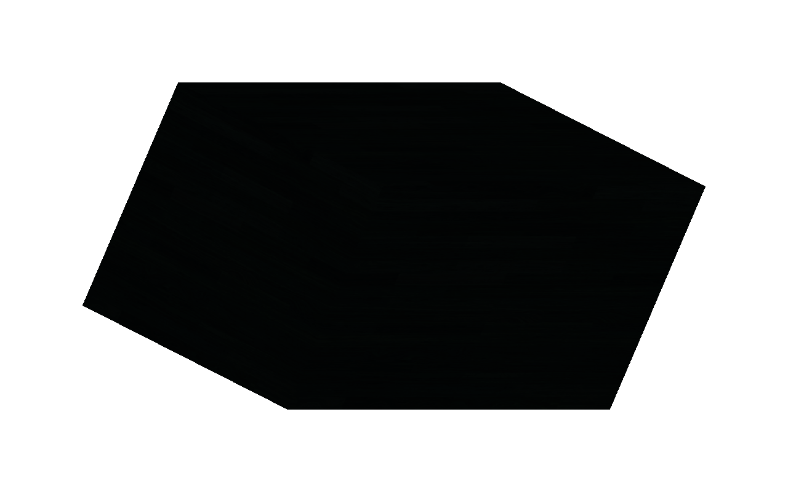

# FLR-0365 — test manual Flutter app-id and size arguments

- Status: Done
- Priority: High
- Owner: Mini QEMU / guest SSH / Flutter surface / QMP evidence roles
- Created: 2026-09-29
- Updated: 2026-09-29
- Predecessor: [FLR-0364 manual guest-SSH baseline](FLR-0364-reproduce-flutter-launch-over-guest-ssh.md)
- Historical control: [FLR-0347 exact-image HUD-visible run](FLR-0347-retest-empty-log-arm-poll-on-exact-image.md), [FLR-0344 launch command](../commands/FLR-0344-launch-production.cmd)
- Working log: [FLR-0365 working log](../logs/2026-09-29-flr0365.md)
- Run ID: `flr0365-0001` (one attempt only)

## Objective

On the same pinned QEMU rootfs as FLR-0364/FLR-0347, manually launch the same installed Example Demo over guest SSH and add only the historical Flutter shell app-id and explicit size arguments: `--xdg-shell-app-id fluorite --width 1280 --height 800`. Keep all renderer/scene diagnostic environment variables unset. Determine whether these command-line surface parameters restore the HUD and classify the native 3D pixels independently.

## Facts

- FLR-0364 used direct guest SSH and one agl-driver process on rootfs SHA-256 `5c8ca252181fac1a64669ae78de5b3fa590db1048f95f156db306df2f9d821ec`. The app produced scene/light and Vulkan activity, but its QMP frame had no HUD, no chromatic pixels, and one unidentifiable monochrome polygon.
- FLR-0347 used the same FLR-0335 rootfs and showed HUD/metrics in QMP while the lower production 3D ROI was black. Its command included the app-id/size parameters plus diagnostic environment variables.
- FLR-0364's ordinary launch already set the Wayland session variables and used the same installed bundle. This ticket changes only the three related CLI surface parameters; it does not copy the full diagnostic environment profile.
- The existing Mini QEMU helper and image are pinned. No image build or bundle transfer is required for this command-only experiment.
- Run `flr0365-0001` used the same rootfs SHA-256 `5c8ca252181fac1a64669ae78de5b3fa590db1048f95f156db306df2f9d821ec`. Strict guest SSH, bundle, Wayland socket, and zero-app preflight passed after selecting the run's existing `ssh_known_hosts` file.
- Manual launch succeeded as `agl-driver` UID 1001, PID 722, with exactly one `flutter-auto` process. The process had the app-id/size arguments and zero FLR/FLUORITE diagnostic environment variables.
- The 1280×800 QMP frame is white with a large black polygon; there is no CPU/FPS/Scenes HUD and no identifiable Sequoia. Full-frame analysis found 598,250 changed pixels versus prelaunch, 4,876 edge pixels in `[133,133,1014,534]`, zero chromatic pixels, and max chroma 4. The HUD ROI `[1120,0,160,80]` is uniformly `224,224,224` with zero edges.
- Eight QMP frames have the same SHA-256 as the still: `f686a3c2769cb2bc59b362bdc1d956c2d1d128cbcbfa6ea45ffe2eb92b4a5265`.
- The bounded app log is 102,124 bytes. It reads `sequoia_ngp.glb`; emissive binding markers appear 18 times (16 ready, 2 not-ready). Vulkan markers show one swapchain, two successful acquires, two queue-present begins, and only one `FLR0026_VK_QUEUE_PRESENT result=0`. The second begin has no logged return.
- At `13:18:05`, the guest kernel recorded a page fault/Oops for TID 764, `Comm: FEngine::loop`; saved RIP `0x7f869bf6d541` lies in the still-mapped `/usr/lib/libLLVM.so.18.1`. TID 764 was absent in the later snapshot while parent `flutter-auto` remained alive with 39 threads. This is temporally adjacent to the unmatched present, not proof of causation.
- The recorded app PID was terminated, QMP accepted `quit`, and run-owned QEMU processes/socket/forwarded port and guest Flutter process were absent afterward.

## Problem stratification — 4W1H (Why excluded)

| Dimension | Evidence | Discriminator |
| --- | --- | --- |
| What | HUD absent on bare launch, present in the historical same-image profile | Add app-id/size arguments only and measure HUD ROI |
| Where | Flutter xdg-shell surface metadata and QMP framebuffer | Direct guest SSH launch with the same bundle/rootfs |
| When | After one fresh QEMU guest reaches SSH-ready | One fresh run ID; no reuse |
| Who | Mini QEMU, guest SSH session, agl-driver Flutter process | Verify one exact process identity |
| How | Preserve session variables, add only app-id and dimensions, capture QMP | No scene/light/debug environment overrides |

## Hypotheses

1. **Leading:** the app-id/size arguments are sufficient to restore HUD pixels on the same rootfs. Prediction: the prior HUD ROI becomes non-uniform and contains CPU/FPS/Scenes indicators.
2. **Alternative:** those arguments are insufficient; one or more historical diagnostic environment settings or another runtime-state difference explains the prior HUD. This run falsifies only sufficiency of the CLI arguments.
3. **Independent 3D hypothesis:** HUD restoration does not guarantee colored Sequoia pixels; native 3D may remain black, monochrome, partial, or become recognizable.

## Scope

### In scope

- One fresh QEMU run using the existing pinned image and helper.
- Direct guest SSH, read-only prelaunch process/bundle/Wayland checks, and one manual agl-driver launch.
- Same bundle and session variables as FLR-0364, adding only the historical app-id/size CLI arguments.
- Bounded app log, full-frame QMP still/eight-frame video, historical HUD/native ROI analysis, and safe teardown.

### Out of scope

- Running the Flutter staging/FIFO/GDB wrapper, editing any shell script, or changing QEMU automation.
- Diagnostic environment overrides, model/material/light/camera/texture changes, or source/recipe/image rebuilds.
- Copying QEMU disk images to Mac or retrying the consumed run ID.

## Success criteria

1. Pinned QEMU helper preflight and guest SSH pass; there are no pre-existing app/runtime targets or occupied ports.
2. Before launch, app count is zero and the installed bundle and Wayland socket exist.
3. Exactly one agl-driver process starts with the Example Demo bundle and the specified CLI arguments; no FLR/FLUORITE diagnostic overrides are present.
4. Save bounded startup/runtime evidence and a full post-launch QMP still plus eight-frame sequence.
5. Quantify the historical HUD ROI `[1120,0,160,80]` and the full frame. Confirm the actual CPU/FPS/Scenes indicators visually rather than counting geometry alone.
6. Report the native 3D ROI separately: identifiable geometry, chromatic pixel count, and any red-tail candidate. Do not call this production 2D+3D success unless both HUD and colored Sequoia are in the same frame.
7. Stop only the recorded app PID, quit QEMU through its QMP socket, and verify zero residual targets/sockets/ports.

## Impact

- **Build-time:** none.
- **Packaging:** none.
- **Runtime:** one manual app launch on the unchanged pinned image.
- **Integration risk:** low; no persistent product or harness change.

## Plan / Do / Check / Act

### Plan

- Use the proven direct-SSH path, not the failed app runner.
- Keep bundle, rootfs, Wayland variables, and all environment overrides fixed/empty relative to FLR-0364; add only the historical app-id and width/height arguments.
- Capture and classify the complete QMP frame and short video, then clean up.

### Do

- Pending. Do not edit the runner or add environment overrides in this ticket.

### Check

| Gate | Expected | Actual | Result |
| --- | --- | --- | --- |
| QEMU/SSH preflight | Exact pinned image; guest SSH ready | Rootfs SHA matched; strict SSH passed with the run-scoped key file | PASS |
| Prelaunch app/session | Zero app; bundle and Wayland present | Zero Flutter processes; bundle/socket present; diagnostic env count 0 | PASS |
| Manual CLI-parity launch | One agl-driver process; only CLI args differ | PID 722, UID 1001, expected app-id/size args; one process | PASS |
| QMP still/video and ROI | Full frame + 8 frames + measured HUD/native regions | Captured; 8/8 hashes identical; full-frame chroma 0; HUD ROI uniformly white | PASS (capture) |
| 2D HUD restored | CPU/FPS/Scenes visible in QMP | No indicators; HUD ROI has zero edges | FAIL |
| Colored production 3D | Recognizable Sequoia with chromatic pixels | No identifiable Sequoia; monochrome polygon; chroma 0 | FAIL |
| Runtime health | App and present path remain healthy | Second queue-present has no return; FEngine loop TID page fault/Oops in libLLVM mapping | FAIL (diagnostic finding; cause UNKNOWN) |
| Teardown | QMP quit and zero residual targets | Recorded app stopped; QMP quit accepted; run residuals 0 | PASS |

### Act

- App-id/size alone did not restore the HUD or colored 3D, so do not change the launch script based on this profile. The FEngine loop page fault and unmatched second present are the strongest new discriminator; capture the faulting thread under GDB in a separate ticket before testing the many historical environment overrides. Do not infer a lighting/texture cause from this result.

## Evidence

- Mini evidence root: `$EVIDENCE_ROOT/flr0365-0001/qemu`
- Exact command, startup markers, 102,124-byte raw app log, targeted graphics markers, kernel tail/Oops excerpt, stop verification, and QMP quit record are retained under that run directory. Raw app-log SHA-256: `2799a20820d4a7bd37dca62a0bce3262b073cbf7a1cfb858ee84d75c338c7b54`; kernel-tail SHA-256: `afd8d99f3c2f5d103a76befe431dcdcfce1ae706ab5df7e3e71ba000fa96303c`.
- QMP PPM SHA-256: `f686a3c2769cb2bc59b362bdc1d956c2d1d128cbcbfa6ea45ffe2eb92b4a5265`; PNG SHA-256: `dddb1b3e017d85600974be4d48c3b4e57990d9460eb573f24cd8587ff477c19d`; eight-frame H.264 MP4 SHA-256: `b3c7a3360229ec09b89b0a9b88533ff53b70452bfbc75418164714691314af2a`.
- 
- [FLR-0365 QMP eight-frame video](../evidence/FLR-0365-qmp-run-0001.mp4)
- Only the 206 KiB PNG and 24 KiB MP4 review artifacts are tracked; no QEMU disk image was copied to Mac.

## UNKNOWN

- Whether the `FEngine::loop` fault caused the unmatched present or the static/monochrome frame.
- Which symbol/function inside the mapped `libLLVM.so.18.1` range contains the faulting RIP; no fault-time GDB backtrace or core was captured in this run.
- Whether historical diagnostic variables are needed for HUD visibility. The historical profile also changes camera, light, model selection, and rendering behavior, so applying it wholesale would confound the next result.
