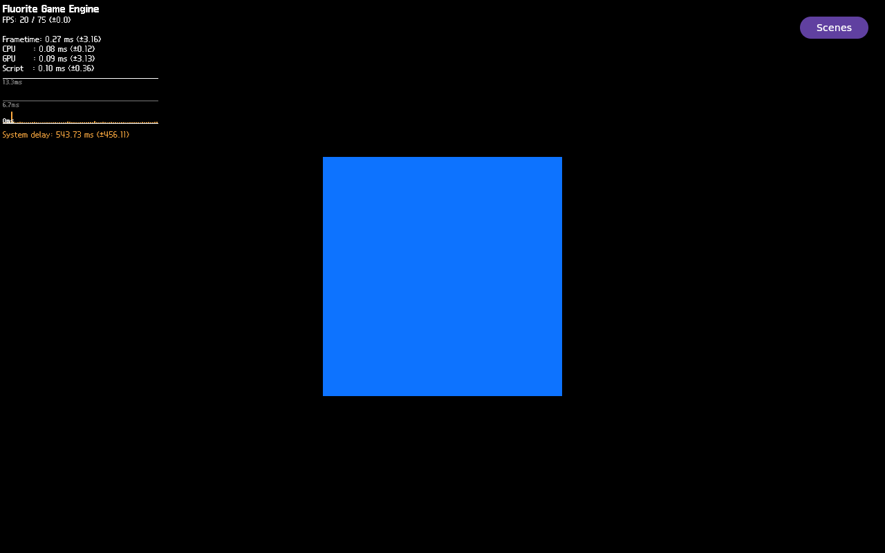

# FLR-0368 — isolate the lit-fixture failure with a manual UNLIT control

- Status: Done
- Priority: High
- Owner: Mini QEMU / direct guest SSH / manual Flutter launch / QMP evidence roles
- Created: 2026-09-30
- Predecessor: [FLR-0367 lit-fixture replay](FLR-0367-replay-manual-known-good-fixture-on-current-image.md)
- Historical positive control: [FLR-0251 HUD + native cube](FLR-0251-restore-known-good-2d-3d-display.md)
- Current image: rootfs SHA-256 `5c8ca252181fac1a64669ae78de5b3fa590db1048f95f156db306df2f9d821ec`
- Run ID: `flr0368-0001` (one fresh attempt)
- Branch: `feature-flr-0368-unlit-fixture-control` (local continuation of the unmerged runtime feature lineage; no push)
- Working log: [FLR-0368 working log](../logs/2026-09-30-flr0368.md)

## Objective

Using the exact current rootfs and FLR-0367's direct manual Flutter command,
remove only `FLUORITE_NATIVE_FIXTURE_LIGHT`. Determine whether the same
self-made geometry appears as UNLIT in a QMP frame together with the Flutter
HUD. This separates an LIT/material/light-specific failure from a shared
geometry-to-visible-target failure. Do not edit launch scripts, source, recipe,
or image in this experiment.

## Facts and hypotheses

### Facts

- FLR-0367 manually launched the current Example Demo and reached fixture
  geometry/material/light/camera setup, 1,040 draw/render/present returns, and a
  visible HUD; its native ROI remained black.
- FLR-0286 previously rendered the LIT fixture and HUD together, but on an older
  rootfs. FLR-0251 also proves simultaneous HUD and self-made native geometry.
- This run used the same current rootfs as FLR-0367:
  `5c8ca252181fac1a64669ae78de5b3fa590db1048f95f156db306df2f9d821ec`.
- Direct strict guest SSH manually launched one `/usr/bin/flutter-auto` as
  `agl-driver` (PID 705). No app-launch helper or source/image change was used.
- The app reported `hardcoded=false shading=unlit source=parameter`, created
  geometry (`vertices=8 indices=36 scene=true`), applied the local camera
  `(0,0,5)->(0,0,0)`, and returned successfully through draw/render/present.
- The full QMP frame contains both the Flutter FPS/frametime/CPU/GPU/system
  delay HUD and a bright blue native geometry face. Native ROI
  `(440,220,400,360)` measured `119716/144000` changed and chromatic pixels,
  bounding box `[467,227,346,346]`, maximum chroma 242. HUD ROI
  `(1120,0,160,80)` measured 2,845 chromatic pixels. These native/HUD chroma
  counts match the historical FLR-0286 positive control exactly.
- QMP PPM SHA-256: `8330d95d624527a936cae189bff82f986d8bec73b887a6265bfa5a309d3c999a`.
  PNG: [full QMP screenshot](../evidence/FLR-0368-qmp-run-0001.png), SHA-256
  `6c8eb83652954d1a83b1eb22e77e11768ae7aa842e230048585648ef2a958c2a`.
  [QMP sequence](../evidence/FLR-0368-qmp-run-0001-sequence.mp4), SHA-256
  `a207cecd5548ba4509204de2ed39c6fe73e788ba65b89c3f664145f9a55b13d6`;
  it is 8 frames encoded at 1 fps for review (source capture interval 0.1s).
- Guest selected-log SHA-256
  `d1571aa27c5e0eb6dc320e5063542fa43daad1df10cf0b910d53b930d35fd9e7`,
  size 114,147,255 bytes. It contains 1,291 draw submits, 1,292 draw ends,
  1,293 ViewTarget render returns, 1,292 successful Vulkan queue presents,
  and 1,292 completed present boundaries; no targeted ERROR/Oops marker was
  found.
- Exact-run teardown was independently verified: app stopped, QEMU supervisor
  PID 2758778 and child PID 2758805 absent, run QMP socket absent, ports
  10930–10932 free.

### Hypotheses

1. **UNLIT pixels return:** geometry and visible-target paths work; the LIT
   material or explicit light branch is the narrower failing boundary.
2. **UNLIT remains black:** fixture creation metadata and present success do
   not produce visible native pixels; investigate the shared geometry,
   rasterization, or target handoff boundary.
3. **Only HUD changes or the app faults before the bounded frame gate:**
   capture the first failed marker and classify the result without inferring a
   3D render from QEMU boot or process liveness.

## Scope and success criteria

- One fresh QEMU run on the pinned current image, using the existing Mini
  receiver/build/TMPDIR and 6144 MiB profile.
- Connect to the guest over strict SSH and manually launch exactly one
  `agl-driver` `/usr/bin/flutter-auto` process from the same Example Demo
  bundle as FLR-0367.
- Keep all FLR-0367 rendering/runtime inputs fixed except remove
  `FLUORITE_NATIVE_FIXTURE_LIGHT=1`; retain the pure fixture, minimal geometry,
  local camera, and force-render setting. Do not introduce an app launcher.
- After the geometry/camera markers, observe at most 8 successful present
  completions or a 45-second deadline, then capture a full 1280x800 QMP still
  and a short bounded QMP sequence. Do not wait for minutes after the result is
  stable.
- Report HUD ROI `(1120,0,160,80)` and native ROI `(440,220,400,360)` separately;
  visually inspect the whole screenshot and record image/log hashes. A positive
  UNLIT result requires visible, identifiable geometry in the native ROI and
  the HUD in the same QMP frame; report changed, edge, and chromatic pixels
  separately so visible grayscale geometry is not misclassified as black.
- Stop only the recorded app and QEMU run, then independently verify exact
  process/socket/port cleanup.

## Impact

- **Build-time / packaging:** none; reuse the current image.
- **Runtime:** one bounded manual app run with the fixture light opt-in unset.
- **Integration risk:** low; no persistent source, recipe, image, or launcher
  changes. A fixture result does not by itself prove production Sequoia.

## Plan / Do / Check / Act

### Plan

- Reuse the exact pinned rootfs, QEMU profile, guest SSH route, bundle, and
  manual launch contract established in FLR-0367.
- Change only the fixture-light opt-in among runtime behavior variables.
- Capture once after setup and a small bounded set of completed presents; stop
  early on the first decisive QMP result.

### Do

- Pending one fresh QEMU run, after verifying canonical repository, free run
  slot, image identity, and one-active-ticket state.

### Check

| Gate | Expected | Actual | Result |
| --- | --- | --- | --- |
| Current image / guest preflight | Exact pinned image, bundle, Wayland, no stale app | All passed | PASS |
| Manual UNLIT fixture launch | One app; `shading=unlit`, geometry and local camera markers | PID 705; expected markers observed | PASS |
| Bounded draw/present | Up to 8 successful returns or exact first divergence by 45 seconds | 1,292 presents over approximately 4m24s; app not stopped promptly | FAIL — process-duration guard missed |
| HUD + native QMP pixels | Separate fixed HUD/native ROI metrics and full-frame visual review | HUD 2,845 chromatic; native 119,716 changed/chromatic; full frame visually reviewed | PASS |
| Evidence | Full QMP still, short sequence, selected markers, hashes | QMP still, PNG, MP4, selected markers and hashes recorded | PASS |
| Teardown | Exact app/QEMU/socket/ports absent | Independent PID/socket/port check passed | PASS |

### Act

- UNLIT geometry is visible with HUD. Keep this as the current-image positive
  control. FLR-0369 tests the LIT branch with only the hardcoded base-color
  override added, to test whether the dynamic material parameter path is the
  first visible-pixel boundary.
- If UNLIT is black while setup/draw/present succeed, open a target/raster
  boundary ticket; do not modify the launcher or lighting code.
- If the guest/app/present gate fails first, open a new task for that exact
  boundary and retain the failure evidence.

## Evidence

- FLR-0367 current-image LIT screenshot/video and measurements.
- FLR-0251 historical same-frame HUD + native cube measurements.
- [Full QMP PNG](../evidence/FLR-0368-qmp-run-0001.png) and
  [8-frame QMP MP4](../evidence/FLR-0368-qmp-run-0001-sequence.mp4).
- Raw QMP PPM SHA-256:
  `8330d95d624527a936cae189bff82f986d8bec73b887a6265bfa5a309d3c999a`.
- Guest-log SHA-256:
  `d1571aa27c5e0eb6dc320e5063542fa43daad1df10cf0b910d53b930d35fd9e7`
  (114,147,255 bytes; retained remotely, not copied into Git).

## UNKNOWN

- Whether the visible-pixel difference inside the LIT path is caused by the
  dynamic material color input, LIT shading, or SUN/light interaction. FLR-0369
  first tests the dynamic color-input boundary.
- Whether this fixture result resolves production Sequoia's black native ROI;
  it does not. Production model/material/camera integration remains unproven.
