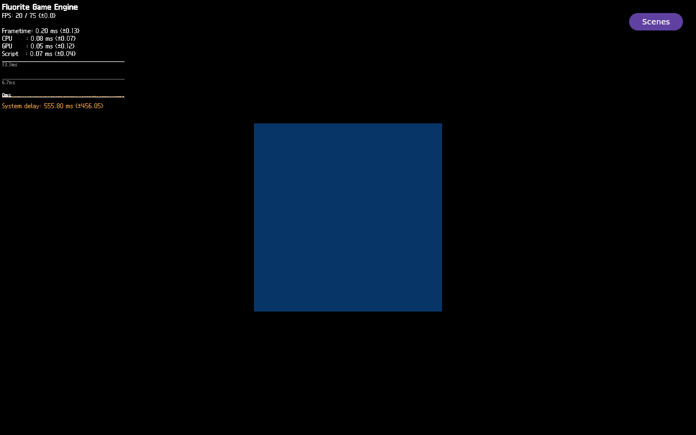

# FLR-0369 — current-image LIT fixture with hardcoded material color

- Status: Done
- Priority: High
- Owner: Mini QEMU / direct guest SSH / manual Flutter / QMP evidence roles
- Created: 2026-09-30
- Run ID: `flr0369-0001`
- Current rootfs: `5c8ca252181fac1a64669ae78de5b3fa590db1048f95f156db306df2f9d821ec`
- Branch: `feature-flr-0369-lit-hardcoded-material-control` (local continuation of the verified FLR-0368 runtime baseline; no push)
- Predecessor: [FLR-0368 current-image UNLIT control](FLR-0368-manual-unlit-fixture-control.md)
- LIT negative baseline: [FLR-0367 manual LIT replay](FLR-0367-replay-manual-known-good-fixture-on-current-image.md)
- Working log: [FLR-0369 working log](../logs/2026-09-30-flr0369.md)

## Objective

Determine whether the current-image LIT fixture's black native ROI is caused
by its dynamic `materialParams.color` input. Reuse the FLR-0367 direct manual
LIT profile and current pinned image; add only the existing
`FLUORITE_NATIVE_HARDCODED_MATERIAL_COLOR=1` runtime flag. Do not edit scripts,
source, recipes, patches, or the image.

## Facts

- FLR-0367 used the current rootfs and LIT fixture with
  `hardcoded=false source=parameter`; HUD and successful draw/present activity
  were present, but native ROI was black.
- FLR-0368 used the same rootfs and fixture geometry with the LIT opt-in
  removed. UNLIT geometry and HUD were both visible in QMP, with 119,716 native
  chromatic pixels and 2,845 HUD chromatic pixels.
- Patch 0249's existing flag changes only the native fixture material source
  from `materialParams.color` to constant blue
  `vec3(0.05, 0.45, 1.0)`. FLR-0154 tested the flag on an older source/image
  lineage and remained black; that historical negative does not decide the
  current image after later fixture changes.
- FLR-0286 proves the LIT fixture can render chromatic geometry with HUD on an
  older rootfs. Production Sequoia remains a separate unresolved path.
- On the current rootfs, the direct manual LIT run selected
  `hardcoded=true shading=lit source=constant`; SUN setup, 8-vertex/36-index
  geometry and local camera all completed. One `agl-driver` app ran as PID 668.
- The full QMP frame visually shows the Flutter FPS/CPU/GPU HUD and a dark blue
  native geometry face together. Native ROI `(440,220,400,360)`:
  `119716/144000` changed and chromatic pixels, edge pixels 2,764, chromatic
  bbox `[467,227,346,346]`, max chroma 95, luma `[0,45]`, dominant color
  `0,32,96`. HUD ROI `(1120,0,160,80)`: 2,990 changed, 988 edge, 2,845
  chromatic pixels.
- QMP PPM SHA-256:
  `861f0e6e85b8680833c36e4a1daa9b6f40d9d6f1c00665997608dd020934ebea`.
  [PNG](../evidence/FLR-0369-qmp-run-0001.png) SHA-256
  `283ec8ab9aa494f817835890153a010170d4039e05fc81501924ef9c2886cbb1`;
  [8-frame MP4](../evidence/FLR-0369-qmp-run-0001-sequence.mp4) SHA-256
  `fedd7cfc7f0cf8809af54342dc047920d71afcc0cb10ffc39b4baea012e59431`.
- Selected runtime log SHA-256
  `4d7655f29c7f69c738154289efa281264bfc66e0cdcb72f5121beae6e9dcf6fe`,
  size 26,956,638 bytes. Marker counts: draw submit 244, ViewTarget render
  return 244, present boundary done 242. The selected log excerpts are
  preserved in [runtime markers](../evidence/FLR-0369-selected-runtime.md);
  the full 26.9 MB guest `/run` log was not copied into Git.
- The process had already exited by the later strict-SSH identity check; the
  intended exact-PID stop was therefore not performed. The last retained log
  lines end after `DRAW_END` / `VIEWTARGET_END_FRAME`; the exit cause remains
  UNKNOWN because guest coredump/journal diagnostics were not collected before
  QEMU shutdown. QMP quit and independent harness preflight passed with zero
  residual targets, absent socket, and ports 10930–10932 free.

## Hypotheses

1. The failing boundary is an interaction between dynamic
   `materialParams.color` and LIT/SUN mode: the same parameter source is visible
   in FLR-0368's UNLIT mode, while constant source is visible in this LIT mode.
2. The LIT shader/material variant or its interaction with SUN handles the
   dynamic parameter differently; inspect current patch/API history before
   attributing this to the C++ setter.

## Procedure / success criteria

- Verify canonical repository, sole active ticket, exact current image hashes,
  free QEMU slot, guest/bundle/Wayland readiness, and no stale Flutter process.
- Manually SSH to the guest as the recorded runtime user and execute the
  existing FLR-0367 Flutter command/profile. Add only
  `FLUORITE_NATIVE_HARDCODED_MATERIAL_COLOR=1`; keep
  `FLUORITE_NATIVE_FIXTURE_LIGHT=1` and all other runtime inputs fixed.
- Confirm `hardcoded=true shading=lit source=constant`, fixture geometry and
  camera setup; capture a full QMP frame and the same fixed HUD/native ROIs.
  Capture selected marker counts/hashes rather than transferring a repeated
  full runtime log.
- Stop the exact recorded app PID immediately after the decisive QMP capture.
  Do not wait for further frame counts while transferring/converting evidence.
  Stop QEMU and independently verify PIDs, QMP socket, and ports absent/free.
- Preserve QMP PNG/short sequence, measurements, hashes, selected runtime
  markers, failures, and teardown result in this ticket and its working log.
- No script/source/recipe/patch/build changes in this task.

## Impact

- Build-time and packaging: none.
- Runtime: one bounded manual fixture run.
- Integration risk: low; one existing diagnostic environment variable only.

## Plan / Do / Check / Act

### Plan

Compare directly against FLR-0367 and FLR-0368 on the identical current image.
The hardcoded-color flag is the sole changed variable relative to the LIT
negative baseline.

### Do

- One fresh QEMU run ID `flr0369-0001`; direct strict guest SSH; exactly one
  manual `/usr/bin/flutter-auto` launch; no script/source/build change.

### Check

| Gate | Actual | Result |
| --- | --- | --- |
| Canonical repository / sole active ticket / QEMU preflight | All passed on pinned rootfs; 6144 MiB; run ID `flr0369-0001` | PASS |
| Manual Flutter and LIT+constant branch markers | `hardcoded=true shading=lit source=constant`; SUN, geometry, camera setup; 244 draw/render returns | PASS |
| QMP full frame and fixed ROI pixel evidence | Native 119,716 chromatic pixels and HUD 2,845; same-frame full screenshot/video | PASS |
| Immediate exact-app and QEMU teardown verification | App exited before explicit PID stop; QMP quit and independent process/socket/port cleanup passed | DEVIATION — exit reason UNKNOWN |

### Act

- Constant-color LIT rendered. FLR-0370 now owns a read-only trace of the
  fixture's actual C++ material-instance parameter contract and existing
  Devtool patch history. Do not patch until that source/API trace identifies
  the exact assignment or binding boundary.
- Keep production Sequoia and combined product acceptance open until its own
  recognizable same-frame QMP evidence passes.

## Conclusion

On the identical current image and LIT/SUN fixture, the parameter-source run
FLR-0367 was black, while this constant-source run showed 119,716 native
chromatic pixels with the HUD. FLR-0368's UNLIT parameter-source control was
also visible. The three-condition comparison therefore localizes the failure
to the interaction of dynamic color expression with LIT/SUN—not a universally
missing color assignment. It does not prove whether LIT shader semantics,
generated parameter binding, or a shader-variant side effect is the cause.
Production Sequoia is not yet verified.

## UNKNOWN

- The exact source/API reason the dynamic material color path produced black.
- Why the app process ended before the intentional PID stop; no core/journal
  evidence was retained from this run.

